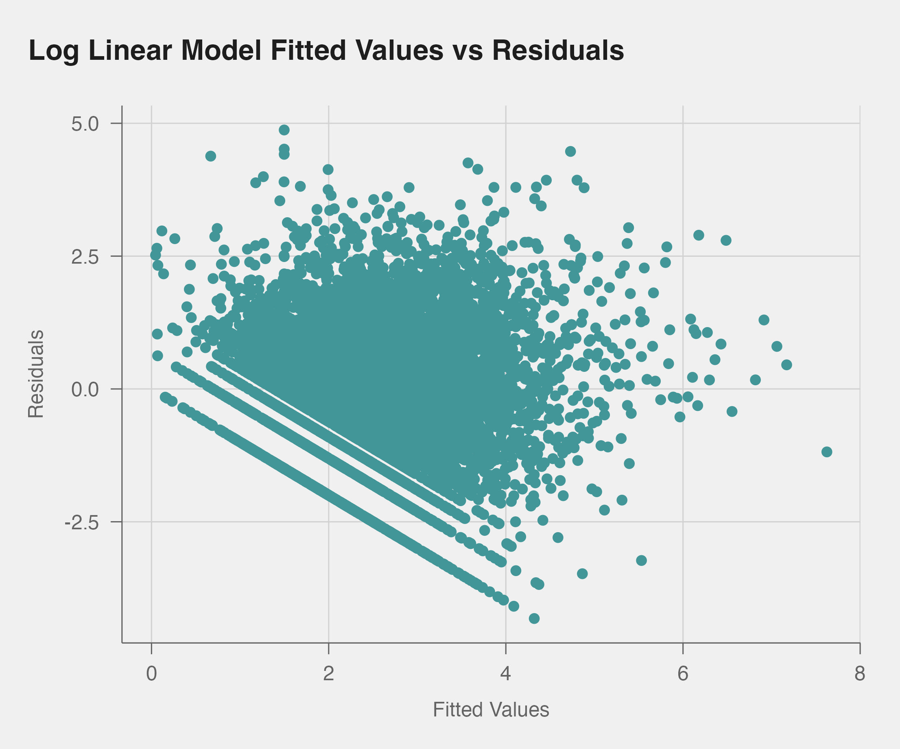

```{r setup, include=FALSE}
knitr::opts_chunk$set(echo   =FALSE,      ## show or suppress the code
                      include=TRUE ,      ## show or suppress the output
                      message=FALSE,      ## omit messages generated by code
                      warning=FALSE,      ## omit warnings generated by code
                      comment=NA,         ## removes the ## from in front of outputs
                      fig.align="center", ## centers all figures
                      fig.height = 4,     ## set the default height
                      fig.width = 8      ## set the default width
                      )
library(tidyverse)
library(pubtheme)
library(gt)
```

## Abstract

This paper is an attempt to learn what types of bills draw the most interest from lobbyists and how lobbying data can be used to predict how far in the legislative process a bill will go. It uses the 111th Congress, which spans 2009 to 2011, as a case study for these questions. Data came from two sources. The non-profit organization OpenSecrets provided data about how frequently a bill was lobbied in the 111th Congress which they drew from Lobbying Disclosure Act Reports, and congress.gov provided information about the bills in the OpenSecrets data including the legislative actions, the topics, Congressional Research Services Summaries, sponsors, cosponsors, committees, and related bills. To understand what types of bills were most lobbied, models where the amount of times a bill was lobbied was the response variable were fit. One such model modeled the log counts of lobbying with a linear model while another modeled the raw counts of lobbying with a negative binomial model. To understand which types of bills advance the furthest in Congress, an ordinal logistic models with the most advanced state of the bill was fit. In all three models, the LASSO was used in order to perform variable selection. Bills that advanced further in Congress were more likely to be lobbied and bills with higher amounts of lobbying advanced further in Congress, but the direction of the causal relationship or relationships was unclear. The data also seems to suggest that issues of high salience tend to be heavily lobbied but less likely to advance in Congress and vice versa. Other issues, such as appropriations, were both heavily lobbied and frequently advanced in Congress.


```{r}
#Load data and perform some basic cleaning that will help with the visualizations
lobby_bills_df <- readRDS("data.rds")

#Create extended versions of variables for naming
lobby_bills_df <- lobby_bills_df %>% 
  mutate(Chamber_long = ifelse(Chamber == "H", "House", "Senate"), Party_long = ifelse(sponsors.party == "D", "Democrat", "Republican"))
```


```{r}
#set default colors. I chose to use these over the pubred and pubblue because red and blue imply Republican and Democrat. I will therefore only use those colors to signify party when appropriate
custom_teal <- "#429698"
custom_gold <- "#e6cd41"
```


```{r}
#First of three reuseable templates for plots because I use a similar format for several plots
barplot_lobby <- function(variable, data = lobby_bills_df, title = NULL, subtitle = NULL, caption = NULL, xlab = "Average Number of Times Lobbied", ylab = NULL, colors = NULL, group_cutoff = 0, order = T, auto_fill = custom_teal) {
  
  if(is.null(colors)) {
    grouped_data <- data %>%
      group_by(!!as.symbol(variable)) %>% 
      summarize(lobbying = mean(Code_appearances), size = n()) %>% 
      filter(size >= group_cutoff) %>% 
      arrange(lobbying) %>% 
      rename(variable = !!as.symbol(variable))
    
    if (order) {
      grouped_data <- grouped_data %>% 
        mutate(variable = factor(variable, levels = variable))
    }
    
    g <- ggplot(grouped_data, aes(x = lobbying, y = variable)) +
      geom_col(width = 0.8, fill = auto_fill)
  } else if (colors != variable) {
    grouped_data <- data %>%
      group_by(!!as.symbol(variable), !!as.symbol(colors)) %>% 
      summarize(lobbying = mean(Code_appearances), size = n()) %>% 
      filter(size >= group_cutoff) %>% 
      rename(fills = !!as.symbol(colors)) %>% 
      ungroup() %>% 
      arrange(lobbying) %>% 
      rename(variable = !!as.symbol(variable))
    
    if (order) {
      grouped_data <- grouped_data %>%
        mutate(variable = as.character(variable)) %>% 
        mutate(variable = factor(variable, levels = variable))
    }
    
    g <- ggplot(grouped_data, aes(x = lobbying, y = variable, fill = fills)) +
      geom_col(width = 0.8)
  } else if (colors == variable) {
    grouped_data <- data %>%
      group_by(!!as.symbol(variable)) %>% 
      summarize(lobbying = mean(Code_appearances), size = n()) %>% 
      filter(size >= group_cutoff) %>% 
      mutate(fills = !!as.symbol(variable)) %>% 
      arrange(lobbying) %>% 
      rename(variable = !!as.symbol(variable))
    
    if (order) {
      grouped_data <- grouped_data %>% 
        mutate(variable = factor(variable, levels = unique(variable)))
    }
    
    g <- ggplot(grouped_data, aes(x = lobbying, y = variable, fill = fills)) +
      geom_col(width = 0.8)
  }
  
  
  
  x_cutoff <- max(grouped_data$lobbying) * 1.2
  
  label_size <- ifelse(nrow(grouped_data >= 10), 4, 1.2)
  
  g <- g + 
    geom_text(aes(label = round(lobbying, 2)), hjust= -0.1, size = label_size) +
    labs(title  = title,
       subtitle = subtitle,
       caption  = caption,
       x = xlab,
       y = ylab,
       fill = colors) +
    theme_pub(type = "bar") +
    expand_limits(x = x_cutoff)
  
  return(g)
}
```


```{r}
#Second of three reuseable templates for plots because I use a similar format for several plots
scatterplots_lobby <- function(variable, data = lobby_bills_df, title1 = NULL, title2 = NULL, xlab1 = NULL, xlab2 = NULL, ylab1 = "Log Lobbying", ylab2 = "Average Lobbying", colors = NULL, group_cutoff = 0, smooth = T) {
  
  g1 <- ggplot(data = lobby_bills_df, aes(x = !!as.symbol(variable), y = log(Code_appearances))) +
    geom_point(color = custom_teal) +
    labs(title = title1,
         x = xlab1,
         y = ylab1) +
    scale_size(range=c(2,6)) +
    coord_cartesian(clip='off', expand=F) +
    theme_pub(type='scatter')
  
  
  grouped_data <- lobby_bills_df %>% 
    group_by(!!as.symbol(variable)) %>% 
    summarise(lobbying = mean(Code_appearances), size = n()) %>% 
    filter(size >= group_cutoff)
  
  g2 <- ggplot(grouped_data, aes(x = !!as.symbol(variable), y = log(lobbying), size = size)) +
    geom_point(color = custom_teal) +
    labs(title = title2,
         x = xlab2,
         y = ylab2) +
    #scale_x_continuous(limits=c(0,6 ), breaks=c(0, 3, 6), oob=squish, labels=comma) +
    #scale_y_continuous(limits=c(0,40), breaks=c(0,20,40), oob=squish, labels=comma) +
    #scale_size(range=c(2,6)) +
    coord_cartesian(clip='off', expand=F) +
    theme_pub(type='scatter')
  
  if(smooth) {
    g1 <- g1 +
      geom_smooth()
  }
  
  print(g1)
  print(g2)
  
}
```


```{r}
#Third of three reuseable templates for plots because I use a similar format for several plots
pubcolors <- c(pubred, pubblue, custom_teal, custom_gold, pubdarkgray)
comparison_states <- function(variable, stages = c("CommitteeConsideration", "PassedCongress"), data = lobby_bills_df, title = NULL, xlab = "Percentage of Bills", ylab = NULL, colors = pubcolors[1:length(stages)], group_cutoff = NULL, size_cutoff = NULL) {
  grouped_data <- data %>% 
    group_by(!!as.symbol(variable)) %>% 
    summarise(Introduced = mean(max_type == "Introduced"),
            CommitteeConsideration = mean(max_type == "CommitteeConsideration"),
            PassedCommittee = mean(max_type %in% c("DischargePetition", "CalendarEntry")),
            FloorConsideration = mean(max_type %in% c("FloorConsideration", "ResolvingDifferences")),
            PassedCongress = mean(max_type %in% c("Veto", "BecameLaw")),
            size = n()) %>%
    mutate(Introduced = Introduced + CommitteeConsideration + PassedCommittee + FloorConsideration + PassedCongress,
         CommitteeConsideration = CommitteeConsideration + PassedCommittee + FloorConsideration + PassedCongress,
         PassedCommittee = PassedCommittee + FloorConsideration + PassedCongress,
         FloorConsideration = FloorConsideration + PassedCongress)
  
  if(!is.null(group_cutoff)) {
    grouped_data <- grouped_data %>% 
    arrange(desc(size)) %>% 
    head(group_cutoff)
  } else if (!is.null(size_cutoff)) {
      grouped_data <- grouped_data %>% 
        filter(size >= size_cutoff)
  }
  
  grouped_data <- grouped_data %>%
    select_if(names(grouped_data) %in% c(variable, stages)) %>% 
    pivot_longer(cols = -!!as.symbol(variable), names_to = "stage") %>% 
    mutate(stage = factor(stage, levels = rev(c("Introduced", "CommitteeConsideration", "PassedCommittee", "FloorConsideration", "PassedCongress")), labels = rev(c("Introduced", "Committee Consideration", "Passed Committee", "Floor Consideration", "Passed Congress")))) %>%
    arrange(desc(value)) %>% 
    rename(variable =!!as.symbol(variable)) %>% 
    mutate(variable = factor(variable, levels = rev(unique(variable))))
  
  #xlim <- max(grouped_data$value) *1.05
  
  ggplot(grouped_data, aes(x = value, y = variable, fill = stage)) +
    geom_col(width = 0.8, position = position_dodge()) +
    theme_pub(type = "bar") +
    labs(title = title, x = xlab, y = ylab, fill = "Stage Reached") +
    scale_x_continuous(limits = c(0, 1)) +
    scale_fill_manual(values = colors) +
    theme(axis.text = element_text(size = 8), legend.text =  element_text(size = 8))
}
```


## Executive Summary

Lobbying in the 111th Congress varied widely with the most lobbied bills being lobbied up to 10,747 times with an average number of times lobbied of 53.64352. The most lobbied bills included several of the most high profile legislative battles of the 111th Congress including the American Recovery and Reinvestment Act, the American Clean Energy and Security Act, the Affordable Care Act, and the Dodd-Frank Wall Street Reform Act. The bills that were lobbied the most on average were economics bills, environmental bills, bills from the Appropriations Committees, Bills from the House Budget Committee, and bills from the Banking, Housing, and Urban Affairs Act. Bills that advanced further in Congress were lobbied more frequently, as the chart below demonstrates; however, this paper was not able to determine whether lobbying causes bills to advance, whether bills advancing causes them to be lobbied more, both, or whether there is an as-yet unknown underlying variable.

```{r}
levels_order <- c("Introduced", "CommitteeConsideration", "DischargePetition", "CalendarEntry", "FloorConsideration", "ResolvingDifferences", "PassedCongress")
modified_bill_type <- lobby_bills_df %>% 
  mutate(max_type = factor(max_type, levels = levels_order, labels = gsub("([A-Z])", " \\1", levels_order))) 

barplot_lobby("max_type", data = modified_bill_type, group_cutoff = 30, title = "Average Number of Times Lobbied by Bill State", order = F) +
  expand_limits(x = 320)
```

This paper fit three different models that predicted two different response variables. Two types of models were fit in order to predict the number of times a bill was lobbied and another was fit to predict the latest step of the legislative process that a bill would reach.

The two models to predict the number of times that a bill was lobbied had similar coefficients for the predictive variables and made similar predictions about the number of times a bill would be lobbied. In the selected model, the most significant legislative state was passing committee, suggesting that the step from receiving consideration in a committee to passing committee is either one that catches the attention of lobbyists or one that additional influence from lobbyists can prove crucial to a bill achieving. The issue areas with the highest predictors in the selected model, in order, were commerce; finance and financial sector; Environmental protection; science, technology, and communications; and energy. The committees with the highest positive predictors of lobbying were Appropriations; Budget; Agriculture, Nutrition and Forestry; Finance; and Health, Education, Labor, and Pensions. Other variables that corresponded with more lobbying were more associated legislative subjects, more cosponsors, an earlier introduction date, more related bills, and being introduced by the Democratic Party. The cross validated root mean square error of the selected model was 261.7.

In the model for the final legislative state of the bill, more lobbying was associated with bills reaching a later state in the process. Log lobbying had a coefficient of 0.154, which means that increasing the log lobbying by 1 (equivalent to multiplying the total amount of lobbying by e) increases the odds of a bill reaching a later state by a factor of 1.17. Somewhat paradoxically, despite this relationship, many of the issue areas and committees with the highest predictors of reaching a later state had a negative relationship with lobbying. These included issues like Arts, Culture, and Religion and Sports and Recreation as well as committees such as the Small Business Committee. Similarly, issues like Finance and Financial Sector and committees like Finance and Agriculture, Nutrition and Forestry were strong negative predictors of a law advancing even though they were strong positive predictors of a law receiving more lobbying. This suggests an interaction between lobbying and issue area and committee that future work should explore. Other factors that made a bill more likely to advance in this model include more legislative subjects, more cosponsors, being introduced earlier in the session, having more related bills, and being introduced by a Democrat. The model had an out-of sample classification error rate of 30.3%.

While more work is necessary to determine the direction or directions of the relationship between lobbying and bills advancing as well as to understand how lobbying affects the advancement of bills on multiple issues, there are several key takeaways from this analysis. In general, it appears that bills on highly salient issues were more likely to be lobbied, but less likely to advance in Congress. Conversely, bills on low salience issues were less likely to be lobbied but more likely to advance in Congress. Despite this inverse relationship, in general bills that were lobbied more advanced further in Congress. Bills on issues of high salience that did not directly affect economic industries, such as civil rights bills, did not attract as much lobbying as bills of issues of high salience that had direct effect on industry, such as regulatory bills.


## Section 1: Introduction 

Lobbying is the practice of companies, individuals, and interest groups seeking to influence governemnt officials to make a decision (National Conference of State Legislators, 2021). Members of Congress are frequent targets of lobbying because of their power to influence which laws are passed. Lobbying is often criticized for its potential to distort the legislative process by giving certain unrepresentative interest groups unfair influence and creating the conditions for regulatory capture. The American political system is noted for an unusually high prevalence of lobbying (Wallach, 2015). The Lobbying Disclosure Act requires that most organizations who lobby Congress and most lobbyists file a quarterly report, but this data is rarely explored and therefore represents a major missed opportunity for increased government transparency (Public Citizen). Among the most relevant issues to understand is how lobbying influences which bills are passed. It is also important to understand which issues tend to attract the most lobbyist interest. It is possible that legislation in Congress is being distorted by the high amounts of lobbying. Beyond just understanding lobbying, it is important to understand what bills are passed in Congress. Very few bills that Congress proposes each year are passed, so any patterns in which bills are passed is highly relevant to the way that Congress works.

The 111th Session of Congress, which lasted from January 3, 2009 until January 3, 2011, was selected as a case study. This is a particularly interesting session of Congress. It was the main session of the first half of Obama's first term, which involved the passage of landmark legislation such as the Affordable Care Act, the Dodd-Frank Wall Street Reform Act, and the repeal of Don't Ask Don't Tell (Library of Congress, Public Laws of the 111th Congress). It also featured the high-profile failed attempt to pass a cap-and-trade system for carbon emissions  (Broder, 2010) and to pass a public option for healthcare (Fisher, 2010). This session of Congress is also when Congress passed the bulk of its response to the Financial Crisis of 2008, including the American Recovery and Reinvestment Act of 2009 and subsequent financial regulation (Zeballos-Roig, 2020). The 111th Congress may not be representative of other sessions of Congress. Democrats held both branches of Congress by large margins and the President was also a Democrat (Ballotpedia, 111th United States Congress). Because of this, it may have seen unusually high productivity on liberal policy goals and an unusual focus on Democrats by lobbyists.

The data for this project comes from two sources. First, information about which bills were the most heavily lobbied comes from OpenSecrets, a 501(c)3 non-profit organization that tracks and publicizes data about money in Politics including political donations, the activity of dark money groups, and lobbying (Open Secrets, Our vision and mission: Inform, empower & advocate). They make their data available to the public through their bulk data program. This paper used the "lobby_bills.txt" file from their collection of Lobbying data. The file contains a row for each appearance of a bill in an LDA report. The number of times that a bill was lobbied can be calculated by counting the number of unique report identifiers that a bill appears in. 

The second data source is the Congress.gov API, which contains detailed information about every bill that has been introduced in Congress since 1973. The information for each bill that the API contains can be found on the [Github page for the API.](https://github.com/LibraryOfCongress/api.congress.gov/blob/main/Documentation/BillEndpoint.md) (Library of Congress, API Documentation Bill Endpoints). For each bill, there is a url for a JSON file containing data about the bill and additional urls that a user can download more specialized data from. For each bill, we collected data from the main JSON file as well as 5 of the nested JSON files. We collected the information on each bill that I had complete lobbying data for in the 111th Congress. We excluded bills that were not of the "H.R." or "S" type because those bills typically do not contain substantive policy. We did not collect data for bills that did not appear in the OpenSecrets data because We did not want to infer that they were never lobbied and because it is challenging to query large amounts of data from the API due to a restrictive rate limit of 1000 queries per hour (each bill requires six queries) and each query is fairly slow. If we had included bills that were not in the OpenSecrets data, there would have been 15055 bills.

Section 2 contains data visualizations that explore the number of times bills were lobbied and demonstrates relationships between the amount of times that a bill was lobbied and several potential explanatory variables including: the date the bill was introduced, the chamber the bill was introduced into, the party of the sponsor, the policy area of the bill, the number of legislative subjects assigned to the bill by the Library of Congress, the number of cosponsors the bill has, the committee the bill was first assigned to, the number of committees the bill was assigned to, the stage of the legislative process the bill reached, and the number of official actions taken on the bill. Section 3 will create two models to predict the number of times bills are lobbied. Section 4 will create a model of the final legislative stage of the bill. Section 5 will discuss these models and highlight some key implications and create visualizations about the Congressional Research Services Summaries and Legislative Subjects for key subsets of the data.

## Section 2: Data exploration and visualization 

This section will explore the lobbying data, primarily by comparing it to several potential explanatory variables. It will also explore how several potential explanatory variables compare to how far a bill gets in Congress.


```{r}
g <- ggplot(lobby_bills_df, aes(x = (Code_appearances))) +
  geom_histogram(fill = custom_teal, color = pubbackgray) +
  labs(title = "Histogram of Lobbying Counts", y = "Counts", x = "Number of times Lobbied")
g %>% 
  pub(type = "hist")


g <- ggplot(lobby_bills_df, aes(x = log(Code_appearances))) +
  geom_histogram(fill = custom_teal, color = pubbackgray) +
  labs(title = "Histogram of Log Lobbying Counts", y = "Counts", x = "Log Number of times Lobbied")

g %>% 
  pub(type = "hist")
```

First, it is important to visualize the shape of the lobbying variable. The first chart shows a histogram of the untransformed lobbying counts. It is clearly highly right skewed. To attempt to correct the right skew, the second histogram shows a log transformed version of the variable. While it appears more normally distributed, a slight right skew remains. As such, it may be appropriate to apply a box-cox transformation to linear models to see if a stronger transformation would be necessary.


```{r fig.height=5}
most_lobbied <- lobby_bills_df %>% 
  arrange(desc(Code_appearances)) %>% 
  head(15) %>% 
  mutate(title = gsub("Act of .*", "Act", title)) %>% 
  mutate(title = gsub("[,].*", "", title)) %>% 
  mutate(title = gsub("for Medicare Beneficiaries and Pension Relief", "...", title)) %>% 
  mutate(title = gsub("and Consumer Protection", "...", title)) %>% 
  mutate(title = factor(title, levels = rev(title)))

x_cutoff <- max(most_lobbied$Code_appearances) * 1.15

ggplot(most_lobbied, aes(x = Code_appearances, y = title, fill = Chamber_long)) +
  geom_col(width = 0.8) + 
  geom_text(aes(label = round(Code_appearances, 2)), hjust= -0.1) +
  theme_pub(type = "bar") +
  theme(axis.text = element_text(size = 7)) +
  labs(title = "Most Lobbied Bills in 111th Congress", y = NULL, x = "Number of Times Lobbied", fill = "Originating Chamber") + 
  expand_limits(x = x_cutoff) +
  scale_fill_manual(values = c(custom_teal, custom_gold))


```

This chart shows the 15 bills that were lobbied the most in the 111th Congress. It primarily includes the most significant bills and the bills that drew the most media attention. The first four bills are the post-recession stimulus package, the proposed cap-and-trade system, the bill that established Obamacare, and the Dodd-Frank post-recession Wall Street regulation package (Library of Congress, Public Laws of the 111th Congress), (Broder, 2010), (Zeballos-Roig, 2020). The top 15 also includes Appropriations bills, which often contain funding for specific projects that serve lobbies in the states and districts of critical votes (Saturno & Lynch, 2023). Other bills include healthcare and energy bills, both of which have industries that are highly engaged in lobbying (OpenSecrets, *Lobbying Industries*).


```{r}
levels_order <- c("Introduced", "CommitteeConsideration", "DischargePetition", "CalendarEntry", "FloorConsideration", "ResolvingDifferences", "PassedCongress")
modified_bill_type <- lobby_bills_df %>% 
  mutate(max_type = factor(max_type, levels = levels_order, labels = gsub("([A-Z])", " \\1", levels_order))) 

barplot_lobby("max_type", data = modified_bill_type, group_cutoff = 30, title = "Average Number of Times Lobbied by Bill State", order = F) 
```

This chart shows that bills that go further in the legislative process draw more lobbying attention. This makes sense because bills that go further would appear more significant to lobbyists and the influence of lobbyists may make legislators more likely to take action on one bill over another. It is unclear which effect is more significant from this visualization.

```{r fig.height = 7}
barplot_lobby("policyArea", group_cutoff = 50, title = "Lobbying by Policy Area") +
  expand_limits(x = 450) +
  theme(axis.text = element_text(size = 7))
```

This chart shows which issues generate the most interest from lobbyists. By far the issue are with the most interest from lobbyists was Economics and Public Fiance. Financial entities are large and powerful and thus have the capacity to heavily lobby, especially in a session like the 111th when there was significant legislative attention (OpenSecrets, *Lobbying Industries*). Other issues in the top of the chart were highly salient in the 111th Congress and have active industries. The issues at the bottom of the list typically do not have large industries with interests in the legislation about this subject (OpenSecrets, *Lobbying Industries*).


```{r fig.height = 5}
house_only <- lobby_bills_df %>% filter(Chamber == "H")
barplot_lobby("first_committee", data = house_only, group_cutoff = 30, title = "Lobbying by House Committee") +
  theme(axis.text = element_text(size = 7))

senate_only <- lobby_bills_df %>% filter(Chamber == "S")
barplot_lobby("first_committee", data = senate_only, group_cutoff = 30, title = "Lobbying by Senate Committee") +
  theme(axis.text = element_text(size = 8))
```

These charts show the lobbying activity by bills from various House and Senate Committees that had at least 30 bills in the data originate in them. By far, the most lobbying attention went to the Appropriations committee, which may be due to the potential for funding for personal projects and other similar "pork barrel" legislation (Citizens against Government Waste, 2023). The Budget and Finance Committees in the House also drew significant attention. The reason for the attention on the Budget may have been similar to the attention on Appropriations. The attention on the Finance committee may have been due to the focus on financial issues following the recession and the high lobbying activity of the financial industry.

On the Senate side, it is interesting how the Finance Committee did not draw as much attention from lobbyists. Instead, bills that were not sent to committee had the highest lobbying activity. This is potentially because these bills are typically those that leadership has decided to fast-track.


```{r}
barplot_lobby("Chamber_long", group_cutoff = 30, title = "Average Number of Times Lobbied by Chamber")
```

Somewhat surprisingly, House and Senate bills are lobbied similar amounts, even though more of the highly lobbied bills come from the House and several House committees draw the most significant lobbying.

```{r fig.height=5}
barplot_lobby("sponsors.fullName", data = house_only, group_cutoff = 28, title = "Lobbying by House Sponsor", colors = "sponsors.party") +
  scale_fill_manual(values = c(pubblue, pubred)) +
  labs(fill = "Party") +
  theme(axis.text = element_text(size = 8))


barplot_lobby("sponsors.fullName", data = senate_only, group_cutoff = 50, title = "Lobbying by Senate Sponsor", colors = "sponsors.party") +
  scale_fill_manual(values = c(pubblue, pubred)) +
  labs(fill = "Party") +
  theme(axis.text = element_text(size = 8))
```

These charts show the average lobbying for the Senators and Representatives that sponsored the most bills in the 111th Congress. Most notably, the most prolific legislators in both chambers are primarily Democrats. This could be because Democrats tend to be more interventionist than Republicans, but it might also be because they were in power and thus had greater ability to pass legislation which made them more likely to propose it. Barney Frank, who was very involved with Wall Street regulation drew the most interest from lobbyists (Ray, 2023). The Senate lobbyists were most drawn to five Senators: Bingaman, Leahy, Durbin, Rockefeller, and Kerry. These Senators were all long-serving senators (all five were in Congress by 1985) and may have had long-standing relationships with lobbyists and interest groups (Library of Congress, *Senator Jeff Bingaman*), (Library of Congress, *Senator Patrick J. Leahy*), (Library of Congress, *Senator Richard J. Durbin*), (Library of Congress, *Senator John D. Rockefeller IV*), (Library of Congress, *Senator John F. Kerry*). They were all also in either party or committee leadership (Bingaman chaired Energy, Leahy chaired judiciary, Durbin was majority Whip, Rockefeller chaired Commerce, and Kerry chaired Foreign Relations), which made them powerful and valuable to lobbyists.


```{r}
senate_r <- senate_only %>% 
  filter(sponsors.party == "R")
house_r <- house_only %>% 
  filter(sponsors.party == "R")

barplot_lobby("sponsors.fullName", data = house_r, group_cutoff = 15, title = "Lobbying by House Sponsor (GOP)", auto_fill = pubred) +
  theme(axis.text = element_text(size = 8))

barplot_lobby("sponsors.fullName", data = senate_r, group_cutoff = 18, title = "Lobbying by Senate Sponsor (GOP)", auto_fill = pubred) +
  theme(axis.text = element_text(size = 8))
```

Because the other graph contained mostly Democrats, these graphs show only the Republicans who sponsored the most bills in the 111th Congress. There are no standouts in the Republican House, but Michael Castle, the representative who drew the most lobbying on this list was known as a moderate and may have been a key swing vote on Democratic-sponsored legislation (Ferraro, 2009). On the Senate side, Grassley and Specter have similar profiles to the five most lobbied Democrats as long-serving members of Congress in leadership positions (Library of Congress, *Senator Chuck Grassley*), (Library of Congress, *Senator Arlen Specter*). They also had moderate reputations which may have brought them to work with Democrats to pass some bipartisan legislation. Chambliss, however, has a different profile as he had only joined Congress in 1995 and was not known for a moderate voting record (Library of Congress, *Senator Saxby Chambliss*).


```{r}
barplot_lobby("sponsors.party", title = "Lobbying by Party of Sponsor", colors = "sponsors.party") +
  scale_fill_manual(values = c(pubblue, pubred)) +
  theme(legend.position = "none")
```

This graph demonstrates how Democrat-sponsored bills were lobbied significantly more than Republican lobbied bills. This is likely a reflection of Democrats controlling both chambers and the presidency meaning their laws tended to have a higher probability of passing.


```{r}
scatterplots_lobby("relatedBills.count", title1 = "Log Lobbying by Number of Related Bills", xlab1 = "Number of Related Bills", xlab2 = "Number of Related Bills", title2 = "Number of Times Lobbied by Binned Number of Related Bills")
```

Some bills are marked as related to each other in Congress. This is often when the same or a similar bill is introduced in the other chamber or when multiple related bills are packaged together. Most bills have very few related bills but some have very many. It may be appropriate to attempt to log-transform it. That said, the scatterplot and loess regression line indicates a potential positive relationship, that is easier to see when results are binned in the second graph. Bills with more related bills may be those that are more involved in active negotiation.


```{r}
scatterplots_lobby("subjects.count", title1 = "Log Lobbying Lobbied by Number of Legislative Subjects", xlab1 = "Number of Legislative Subjects", xlab2 = "Number of Legislative Subjects", title2 = "Lobbying by Binned Number of Legislative Subjects", group_cutoff = 30)
```

The relationship between lobbying and the number of associated legislative subjects is similarly seemingly positive, but like with the count of related bills a log transform may be approrpiate. The number of legislative subjects might be thought of as a proxy for legislative complexity given that more complex laws will touch more subjects and less complex laws will touch less subjects. That said, some subjects may be more similar to each other and be more likely to appear alongside each other in the same bill so caution is warranted in applying this proxy rigidly.


```{r}
scatterplots_lobby("actions.count", title1 = "Log Lobbying by Number of Legislative Actions", xlab1 = "Number of Legislative Actions", xlab2 = "Number of Legislative Actions", title2 = "Lobbying by Binned Number of Legislative Actions", group_cutoff = 30)
```

A legislative action is when any official step is taken to advance the bill including scheduling a hearing, holding a hearing, or holding a vote. Taking more legislative actions is a proxy for moving a law closer to passage, but some bills may require more actions to reach the same stage. This variable shows a similar pattern to the other two count variables. This could, however, just be a restatement of the variable that measures the furthest that the bill reaches in Congress.

```{r}
scatterplots_lobby("committees.count", title1 = "Log Lobbying by Number of Committees", xlab1 = "Number of Committees", xlab2 = "Number of Committees", title2 = "Lobbying by Binned Number of Committees", group_cutoff = 10)
```

While it is rare, some bills are assigned to multiple committees if it lies in an area of significant overlap and it can also be thought of as a proxy for complexity. That said, there doesn't appear to be as significant a relationship between this variable and the number of times a bill was lobbied.


```{r}
scatterplots_lobby("cosponsors.count", title1 = "Log Lobbying by Number of Cosponsors", xlab1 = "Number of Cosponsors", xlab2 = "Number of Legislative Subjects", title2 = "Lobbying by Binned Number of Cosponsors", group_cutoff = 30)
```

A cosponsor is a member of Congress who signs onto a bill that they did not sponsor but would like to be passed. Sometimes, cosponsors are just as involved as sponsors in trying to pass the bill (The American Legion, Part 4: Sponsors and co-sponsors). Other times, members only cosponsor to signal support but do not become involved in its passage. High-profile bills tend to draw more cosponsorships, so it is interesting to see that bills with more cosponsors are do not appear to generate more interest from lobbyists form this bivariate relationship.


```{r}
scatterplots_lobby("introducedDate", title1 = "Log Lobbying by Date Introduced", xlab1 = "Date Introduced", xlab2 = "Date Introduced", title2 = "Lobbying by Binned Date Introduced", group_cutoff = 30)
```

Bills are introduced throughout the two-year Congressional session. Often, the highest priorities are introduced first, but this is not always true. Bills that are introduced earlier are also able to be lobbied about for longer. As such, it is not suprising to see higher lobbying activity on bills that were introduced earlier in the term.


```{r}
stage_party <- lobby_bills_df %>% 
  group_by(sponsors.party) %>% 
  summarise(Introduced = mean(max_type == "Introduced"),
            CommitteeConsideration = mean(max_type == "CommitteeConsideration"),
            PassedCommittee = mean(max_type %in% c("DischargePetition", "CalendarEntry")),
            FloorConsideration = mean(max_type %in% c("FloorConsideration", "ResolvingDifferences")),
            PassedCongress = mean(max_type %in% c("Veto", "BecameLaw"))) %>% 
  pivot_longer(cols = -sponsors.party, names_to = "stage") %>% 
  mutate(stage = factor(stage, levels = c("Introduced", "CommitteeConsideration", "PassedCommittee", "FloorConsideration", "PassedCongress"), labels = c("Introduced", "Committee Consideration", "Passed Committee", "Floor Consideration", "Passed Congress")))%>% 
  mutate(sponsors.party = ifelse(sponsors.party == "D", "Democrat", sponsors.party)) %>% 
  mutate(sponsors.party = ifelse(sponsors.party == "R", "Republican", sponsors.party))

colors <- c(pubblue, pubred)

ggplot(stage_party, aes(x = stage, y = value, fill = sponsors.party)) +
  geom_col(width = 0.8, position = position_dodge()) +
  theme_pub(type = "bar") +
  labs(title = "Final State of Bills by Sponsor Party", x = NULL, y = "Percentage of Bills", fill = "Sponsor's Party") +
  scale_y_continuous(limits = c(0, 0.7)) +
  scale_fill_manual(values = colors) +
  theme(axis.text = element_text(size = 8))
```

This graph shows the difference in the legislative success of bills introduced by Democrats and Republicans. Bills introduced by Democrats are more likely to pass committee and to reach stages beyond Committee Stage, which reflects Democrats controlling both chambers.


```{r}
stage_chamber <- lobby_bills_df %>% 
  group_by(Chamber) %>% 
  summarise(Introduced = mean(max_type == "Introduced"),
            CommitteeConsideration = mean(max_type == "CommitteeConsideration"),
            PassedCommittee = mean(max_type %in% c("DischargePetition", "CalendarEntry")),
            FloorConsideration = mean(max_type %in% c("FloorConsideration", "ResolvingDifferences")),
            PassedCongress = mean(max_type %in% c("Veto", "BecameLaw"))) %>% 
  pivot_longer(cols = -Chamber, names_to = "stage") %>% 
  mutate(stage = factor(stage, levels = c("Introduced", "CommitteeConsideration", "PassedCommittee", "FloorConsideration", "PassedCongress"), labels = c("Introduced", "Committee Consideration", "Passed Committee", "Floor Consideration", "Passed Congress"))) %>% 
  mutate(Chamber = ifelse(Chamber == "H", "House", Chamber)) %>% 
  mutate(Chamber = ifelse(Chamber == "S", "Senate", Chamber))

colors <- c(custom_teal, custom_gold)

ggplot(stage_chamber, aes(x = stage, y = value, fill = Chamber)) +
  geom_col(width = 0.8, position = position_dodge()) +
  theme_pub(type = "bar") +
  labs(title = "Final State of Bills by Originating Chamber", x = NULL, y = "Percentage of Bills") +
  scale_y_continuous(limits = c(0, 0.85)) +
  scale_fill_manual(values = colors) +
  theme(axis.text = element_text(size = 8))
```

This chart compares the legislative path of bills introduced in the Senate and the House. Very few Senate bills receive any committee consideration which reflects its nature as a slower-moving body than the house. That said, it is interesting to see the chamber of origin influencing the legislative path of a bill more significantly than the party of its sponsor.


```{r fig.height = 5}
comparison_states("policyArea", title ="Minimum State Reached by Topic Area", colors = rev(c(custom_teal, custom_gold)), group_cutoff = 12)
```

This comparison of the legislative paths of bills about different subjects shows that financial bills do not typically advance far in Congress but environmental and security bills often receive committee consideration. The bills that pass the most are those related to Government operations and similar subjects.


```{r fig.height = 5}
comparison_states("first_committee", data = house_only, title ="Minimum Stage Reached by House Committee", colors = rev(c(custom_teal, custom_gold)), group_cutoff = 12)
```

This visualization shows a similar pattern to the policy areas. In most committees, it is very easy for bills to get a committee hearing, but very hard to pass a law. The exceptions are the Financial Services Committee, and the Ways and Means Committee, which controls tax and government revenue policy, where very few introduced laws received a hearing.


```{r fig.height = 5}
comparison_states("first_committee", data = senate_only, title ="Minimum Stage Reached by Senate Commitee", colors = rev(c(custom_teal, custom_gold)), group_cutoff = 12)
```

The legislative paths from different Senate committees is likewise varied. Bills without a committee automatically move to floor consideration and seem to be highly likely to pass. Like the other graphs, this one shows that financial bills often to not receive committee consideration whereas energy and environment bills do.


```{r fig.height = 5}
house_d <- house_only %>% 
  filter(sponsors.party == "D")
comparison_states("sponsors.fullName", data = house_d, title = "Bills Sponsored by Dem House Members", colors = c(publightblue, pubblue), group_cutoff = 12)
```


```{r fig.height = 5}
senate_d <- senate_only %>% 
  filter(sponsors.party == "D")
comparison_states("sponsors.fullName", data = senate_d, title = "Bills Sponsored by Dem Senators", colors = c(publightblue, pubblue), group_cutoff = 12)
```

```{r include = F}
obserstar <- lobby_bills_df %>% 
  filter(sponsors.fullName == "Rep. Oberstar, James L. [D-MN-8]")

nrow(obserstar)
table(obserstar$max_type)

obserstar$title[obserstar$max_type == "BecameLaw"]
```


This chart shows the variety of legislative success that Democrats in Congress have in passing legislation. The bills sponsored by some members of the House appear to always receive committee consideration while others struggle to get committees to consider their bill. Senators face particularly strong challenges to their bills receiving committee consideration. James Oberstar seems to have had a uniquely productive year; nine of the 30 bills that he sponsored became law. Upon further investigation, one of these was to rename a building, four of them were related bills about airline safety, and two of them were related to the Coast Guard Authorization Act. That leaves two remaining substantive standalone bills, one on predisaster hazard mitigation and one on tax relief and unemployment insurance. This remains a highly productive legislative session for Representative Oberstar, but perhaps not quite as much of an outlier as the visualization makes it seem.


```{r fig.height = 5}
comparison_states("sponsors.fullName", data = house_r, title ="Bills Sponsored by GOP House Members", colors = c(publightred, pubred), group_cutoff = 12)
```


```{r fig.height = 5}
comparison_states("sponsors.fullName", data = senate_r, title = "Bills Sponsored by GOP Senators", colors = c(publightred, pubred), group_cutoff = 12)
```

```{r include = F}
sum(lobby_bills_df$sponsors.fullName == "Sen. Graham, Lindsey [R-SC]")
```


These visualizations demonstrate the challenges facing Republicans in the Democratic Controlled House. None of the 12 most prolific bill sponsors in either chamber successfully passed more than one law that they sponsored. GOP Senators faced particularly stiff challenges as very few of their bills received committee consideration. In particular, Lindsey Graham, despite sponsoring 47 bills in the 111th Congress, was not able to receive consideration for a single one of them in a committee.


## Section 3: Modelling Lobbyism

```{r include = F}
mean(lobby_bills_df$Code_appearances)
var(lobby_bills_df$Code_appearances)
```


The first quantity modeled is the number of times that a bill is lobbied. There are two ways of modelling this variable. One of these is to use a model that is designed for count data. While poisson is the typical method for count data, it assumes that the mean and variance are the same; however the mean of the lobbying counts is 53.64352 and the variance is 80222.47, which are nowhere near close to each other. As such, a negative binomial distribution should be used instead, which is appropriate for count data with overdispersion.

An alternative would be to apply a transformation to the lobbying counts and create a linear model. It is theoretically preferable to use a negative binomial model, but a linear model may be more interpretable. As demonstrated in section 2, the lobbying data is highly skewed right, but appears nearly normal when log transformed. That said, the transformation did not make a perfect normal distribution so it is worth conducting a box-cox transformation, which also suggests that a log transformation is appropriate (see Appendix A).

For both models the observed variable is the number of times lobbied, the observation is the Congress.gov information about each bill, and the potential predictors are:

- The date introduced
- The party of the sponsor
- The main committee the bill is assigned to (34 levels)
- The number of committees the bill is assigned to
- The Policy Area (34 levels)
- The number of legislative subjects (log transformed)
- The number of cosponsors (log transformed)
- The number of related bills (log transformed)
- The number of actions taken on the bill (log transformed)
- The final state of the bill (7 levels: Introduced, Committee Consideration, Discharge Petition, Calendar Entry, Floor Consideration, Resolving Differences, and Passed Congress)

Chamber of Origin is also a potential predictor, but since there are no committees that are in both chambers it would be redundant to include both in a model. It is therefore only included as a potential bivariate relationship and is excluded from the multivariate models.

A negative binomial model assumes that data comes from a negative binomial distribution that can model count data. It can be thought of as flipping a weighted coin a number of times an counting how many heads appear before a set number of tails appear. (Roback & Legler, *4.9 Overdispersion* 2021)

Sampling $Y$ from a binomial distribution with parameters r and p is equivalent to the following:

$Y|\lambda$ ~ $\text{Poisson}(\lambda)$ and $\lambda$ ~ $\text{Gamma}(r, \frac{1-p}{p})$ (Roback & Legler, *4.9 Overdispersion* 2021)

In this case, $E(Y) = \frac{rp}{1-p} =: \mu$ and $Var(Y) = \frac{rp}{(1-p)^2}=\mu+\frac{\mu^2}{r}$. The difference between the mean and the variance is thus determined by $r$, which means $r$ can be estimated by observing the overdispersion of the response variable (Roback & Legler, *4.9 Overdispersion* 2021).

It is a generalized linear model with $\log(1-p)$ as its canonical link function.

The assumptions of a negative binomial distribution are:

- The response variable is generated from a negative binomial distribution
- The responses are independent from each other
- $\log(1-p)$ is linear with respect to the variables of $X$
(Roback & Legler, 2021)


The fact that this is overdispersed count data gives strong reasons to believe the first assumption and the visualizations demonstrate a strong likelihood of meeting the third assumption. It is unlikely that the lobbying counts of each bill are independent given the complex dynamics of the legislative and political system, but that might not have bearing on the effectiveness of the model.


The linear model on the other hand assumes that $Y$ is sampled from a normal distribution with a mean equal to $X\beta$, where $\beta$ is a vector of coefficients and a constant error. It can therefore be simply writte as:

$Y = X\beta + \varepsilon$ where $\varepsilon$ is a vector with the same length as $Y$ that has values sampled from $N(0, \sigma^2)$

The assumptions of a linear model are:

- There is a linear relationship between $Y$ and $X$
- The errors are independent
- The values of $Y$ are normally distributed at all levels of $Y$
- The variance fo $Y$ is constant for all values of $X$
(Roback & Legler, *1.3 Assumptions for Linear Least Squares Regression* 2021)

While there is a similar issue with meeting the independence of errors assumption, the linear relationship and normal distribution of $Y$ can be created with the log transformation. The assumption of normally distributed errors with constant variance can be checked after fitting a model. The transformation, however, makes the log linear model a less neat fit than the negative binomial model.


Two types of models were fit for each class of model. First, a series of bivariate relationships. Second, a multivariate model with predictors chosen by the LASSO. To create this model, a LASSO regression on a model with every possible predictor was fit after normalizing each variable. The predictors whose coefficients were 0 were removed and then a best fit model was fit.

The following tables summarize the bivariate relationships in both the log linear model and the negative binomial model.

```{r}
bivariate_lobbying <- read.csv("bivariate_lobbying_table.csv")
bivariate_lobbying <- bivariate_lobbying %>% 
  select(-X) %>% 
  arrange(AIC_nb) %>% 
  mutate(predictor = gsub("([A-Z])", " \\1", predictor)) %>% 
  mutate(predictor = gsub("[.]", " ", predictor)) %>% 
  mutate(predictor = gsub("[_]", " ", predictor)) %>% 
  mutate(predictor = trimws(predictor)) %>% 
  mutate(predictor = str_to_title(predictor)) %>% 
  mutate(p_val_nb = case_when(p_val_nb < 0.001 ~ "<0.001***",
                             p_val_nb < 0.01 ~ paste0(round(p_val_nb, 2), "**"),
                             p_val_nb < 0.05 ~ paste0(round(p_val_nb, 2), "*"),
                             p_val_nb >= 0.05 ~ as.character(round(p_val_nb, 2)))) %>%
  mutate(p_val_lm = case_when(p_val_lm < 0.001 ~ "<0.001***",
                             p_val_lm < 0.01 ~ paste0(round(p_val_lm, 2), "**"),
                             p_val_lm < 0.05 ~ paste0(round(p_val_lm, 2), "*"),
                             p_val_lm >= 0.05 ~ as.character(round(p_val_lm, 2)))) %>% 
  rename(Variable = predictor, `Linear Coefficient` = coef_lin, `Negative Binomial Coefficient` = coef_nb, `R Squared` = r2, `Adj R Squared` = r2.adj, `Linear AIC` = AIC_lm, `Linear Model P Value` = p_val_lm, `Negative Binomial AIC` = AIC_nb, `Negative Binomial Model P Value` = p_val_nb) 

bivariate_lin <- bivariate_lobbying %>% 
  select(Variable, `Linear Coefficient`, `R Squared`, `Adj R Squared`, `Linear AIC`, `Linear Model P Value`)

bivariate_nb <- bivariate_lobbying %>% 
  select(Variable, `Negative Binomial Coefficient`, `Negative Binomial AIC`, `Negative Binomial Model P Value`)


bivariate_lin |>
  gt() |>
  tab_header(title = "Log Linear Model of Lobbying", subtitle = "Bivariate Relationships Table")

bivariate_nb |>
  gt() |>
  tab_header(title = "Negative Binomial Model of Lobbying", subtitle = "Bivariate Relationships Table")
```

Coefficients and AIC values should not be compared for different types of models. The coefficients in different models refer to different relationships. The AIC for the negative binomial model is also significantly higher because it measures penalized deviance from the full lobbying values while the linear model AIC measures penalized deviance from the log transformed values. According to the AIC of the negative binomial model, the strongest predictor is the number of legislative subjects. In general, the predictors related to the topic of the bill and how far it gets are strongest. The weakest predictor is the originating chamber, which is not going to be included in the full model anyway.


Next, we use LASSO to perform model selection as described above. The selected regularization parameter For Linear LASSO was the highest regularization parameter within 1 standard error of the lambda with the minimum cross validated mean square error.


After performing the LASSO on the log linear model and selecting $\lambda$, 51 predictors of the original 80 predictors remained. The variables that had become zero were: 9 policy area predictors (Animals, Economics and Public Finance, Emergency Management, Foreign Trade and International Finance, Housing and Community Development, Labor and Employment, Law, None, and Private Legislation), 16 committees of origin (Banking, Housing, and Urban Affairs; Budget; Education and the Workforce; Energy and Natural Resources; Environment and Public Works; Foreign Relations; Homeland Security and Governmental Affairs; Homeland Security; Select Intelligence; Judiciary; Natural Resources; Rules and Administration; Transportation and Infrastructure; Veterans' Affairs; and Ways and Means), and 4 steps of the legislative process (Introduced, Discharge Petition, Floor Consideration, and Passed Congress). Interestingly, of the three steps that remained: Committee Consideration, Resolving Differences, and Calendar Entry, two of them are consecutive in the legislative process: Committee Consideration and Calendar Entry. This suggests that perhaps getting out of the committee stage is what lobbyists consider the crucial step in passing a law. 


```{r include = F}
log_lin_coefs <- read.csv("log_lin_coefs.csv")
log_lin_coefs %>% 
  filter(!grepl("max_type", variable) & !grepl("policyArea", variable) & !grepl("first_committee", variable))

log_lin_coefs %>% 
  filter(grepl("max_type", variable))

log_lin_coefs %>% 
  filter(grepl("policyArea", variable))

log_lin_coefs %>% 
  filter(grepl("first_committee", variable))
```


The full table of coefficients for the selected linear model can be found in Appendix C.

Turning first to the predictors other than the 3 categorical variables:

- There was a highly significant positive effect of the number of legislative subjects, indicating that more complex laws draw more interest from lobbyists
- Bills sponsored by Republicans received less interest from lobbyists in this democratic controlled Congress
- Bills with more cosponsors were lobbied more
- Bills with more actions on them were more likely to be lobbied.
- Bills introduced later in the session were lobbied less
- Bills with more related bills were lobbied more

Many of these relationships were visible in the visualizations. 

Bills were lobbied more at the Calendar Entry and Discharge Petition and lobbied less at the Committees stage. This supports the theory that the transition between committee and the floor draws significant lobbyist attention, which is visible in the sharp jump in average lobbying between the Committee Consideration Stage and the Calendar Entry Stage.

As was also evident in the visualizations, bills from the appropriations committee were heavily lobbied, as were bills from the Finance Committee. The bills from the Agriculture, Nutrition, And Forestry Committee were also heavily lobbied, which was not as evident in the visualizations. The small business committees in both chambers had the strongest negative coefficient, which perhaps reflects the fact that small businesses do not have the resources for major lobbying operations.

The issues that were lobbied the most heavily were Science, Technology, Communications; Finance; and energy. Finance and energy were two of the most hotly debated issues in this legislative session due to the financial crisis and the proposed cap-and-trade system, so these are not surprising (Cohen, 2010). It would be interesting to investigate why the Science bills were highly lobbied more because it does not immediately appear to be a major issue or to be connected with a major special interest. On the other side of the spectrum, bills about Sports, Congress itself, Social Science/History, and the Arts had the lowest coefficients. These tend to be low-temperature issues without strong special interests in play so it makes sense that they would not draw significant amounts of lobbying.


A plot of the residuals against the fitted values can indicate how well a linear model meets the assumptions. While most of the plot shows that the model meets the assumptions, the diagonal lines in the bottom left hand corner indicate a problem with results with low fitted values. This is reflective of this model's poor theoretical fit with the count data and counts against selecting it as a model for lobbying if the negative binomial model can perform similarly well.




The R function for LASSO regression on a negative binomial model from the "mpath" package does not have the same cross validation function as the function for LASSO regression in linear models from the "glmnet" package, but it provides the AIC and BIC for the models at each value of $\lambda$. The selected value of $\lambda$ was whichever of model with the optimal AIC or BIC that had fewer predictors. In this case, that was the $\lambda$ with the lowest BIC, which produced a model with 65 predictors selected from the original set of 80 potential predictors. The 15 predictors removed were all categorical like with the linear model. It removed four stages of the legislative process (Introduced, DischargePetition, FloorConsideration, and PassedCongress), two policy areas (Economics and Public Finance, Health), and nine committees (Energy and Commerce, Foreign Relations, Homeland Security and Governmental Affairs, Select Intelligence, Natural Resources, Rules and Administration, Veterans' Affaris, and Ways and Means). This is a similar set of predictors that were removed in the linear model, including exactly the same steps of the legislative process as the linear model.

```{r include = F}
nb_coefs <- read.csv("nb_coefs.csv")
nb_coefs %>% 
  filter(!grepl("max_type", variable) & !grepl("policyArea", variable) & !grepl("first_committee", variable))

nb_coefs %>% 
  filter(grepl("max_type", variable))

nb_coefs %>% 
  filter(grepl("policyArea", variable)) %>% 
  arrange(desc(Estimate))

nb_coefs %>% 
  filter(grepl("first_committee", variable)) %>% 
  arrange(desc(Estimate))
```

The full table of Coefficients can be found in Appendix D. 

In general, the predictors of the negative binomial model are similar to those of the log linear model.

The direction of the coefficients for the three legislative steps is the same as the direction in the log linear model and have similar values.

The coefficients of the committees are in a similar order as in the linear model. Appropriations has the strongest positive coefficient, followed by Budget, Agriculture, and Finance. Just as in the linear model, the strongest negative coefficients were the small business committees.

As with the linear model, economic, energy/environmental, and health subjects had the highest coefficients and the lowest were low-salience subjects like Congress, Social Sciences, and the Arts. Civil rights was also among the policy areas with the lowest coefficients. There are no industries that would highly lobby on this subject, but it is higher salience than other subjects with low coefficients so it is somewhat surprising that it has such a low coefficient.

The Root Mean Square Error of the log linear model after performing 5-means cross-validation and exponentiating the predictions was 268.2252. The Root Mean Square Error of the Negative binomial model after performing 5-means cross-validation was 261.7179. This means that the Negative Binomial has a stronger theoretical relationship to the data, stronger case to meet the model assumptions, and a stronger fit to the data, though it is possible that with a different iteration of the 5-means cross-validation the linear model would have performed better. For both models, even given the scale of the data, this is a relatively high error, which reflects the high variance in the lobbying counts. The high RMSE suggests that this model may be more useful to understand the relationships within the lobbying data than it is for predicting how much a bill will be lobbied.

Often, linear models are more interpretable than other models, but this advantage is weak when a transformation is applied to the response. As such, it seems that the negative binomial model is likely superior to the log linear model.


## Section 4: Modelling Final Bill State

Another type of model is that can be built with this data is a model for how far a bill reaches in the legislative process. This treats the final legislative state of the bill as $y$, the response variable, and the log number of times lobbied as one of the columns in $X$. The other predictors used in the modelling in Section 3 can also be used as predictors in this section with the exception of the number of actions because that variable is essentially a proxy for how far a bill gets so it is not an interesting relationship to analyze. Including it could also dilute the effects of other predictors and interfere with potential insights.

The path of a law in Congress can be complex, but in general it follows a series of steps beginning with its introduction, followed by consideration in committee, then consideration on the floor of Congress. As a result, the bill state should be considered an ordinal categorical variable. For the purposes of modelling the many legislative steps were simplified into 5:

1. Introduced into Congress

2. Considered by a Congressional Committee: This can involve any type of hearing, markup, or vote on the bill by a committee or subcommittee

3. Passed by a Congressional Committee: After a bill is passed in committee, it is placed on the legislative calendar. Some bills can bypass the committee process with a discharge petition, which is a rare process used to consider a bill on the Floor of Congress even if it hasn't passed committee. Bills whose highest state was either "Calendar Entry" or "Discharge Petition" were 

4. Floor Consideration: Not all bills that pass committee receive consideration by the entire chamber. Bills in this state were debated or voted on in the floor of Congress, but did not pass both chambers. If a bill passed both chambers but the chambers were not able to agree on the same version of the law, it was also classified in this state.

5. Passed Congress: Bills that passed both chambers and went to the president were included in this category. All but one of these bills became law, the other was vetoed.

(Congresswoman Eleanor Holmes Norton, How a bill becomes a law)

Because the response variable is ordinal, the appropriate model is a ordinal logistic regression model. This models the log odds of the cumulative probability of being up to a given state in the model as a linear function of its predictors, whereas traditional multinational regression models models the log odds of the probability of being at one state.

This is represented as:

$\log(\frac{P(Y~\leq ~l)}{P(Y~> ~l}) = \zeta_l - \eta_1X_1 - \eta_2X_2...-\eta_pX_p$ for a model with $p$ predictors where $l$ represents one of the states in the model (Nahhas, *6.22 Ordinal Logistic Regression*).

Each $\zeta$ term is analogous to an intercept and is the log odds of being anywhere up to state $l$ when all predictors are at 0 or their reference level. Each $\eta$ term is analogous to a $\beta$ value ad returns the log odds ratio of the cumulative probabilities. A positive value of $\eta$ corresponds to a higher cumulative odds of being at higher levels (Nahhas, *6.22 Ordinal Logistic Regression*). These coefficiets can be more challenging to interpret than those in a linear model, but when they are exponentiated, they are odds ratios which is easier to interpret.

The assumptions of Ordinal Logistic Regression are:

- The dependent variable is measured on an ordinal level
- One or more of the independent variables are either continious, categorical or ordinal
- No Multi-collinearity
- Proportional Odds - each independent variable has an identical effect at each cumulative split of the ordinal dependent variable

As discussed, the first assumption is met because the stages of the legislative process follow each other in a set order. The second assumption is met as all predictors are either continuous or categorical. There may be multi-colinearity in the variables, but not significant enough to affect the validity of the results. Finally, there is no evidence to suggest that the Proportionality Odds assumption is either met or not met. It could be true, for example, that lobbying is highly associated with bills moving from the introduced stage to being considered in committee but not associated with any other steps. If the model performs poorly and unevenly, a violation of this assmption could be one reason why.

The following table summarizes the bivariate ordinal models between the bill state and all of the potential predictors.

```{r}
ordinal_bivariate <- read.csv("ordinal_bivariate.csv") %>% 
  arrange(AIC) %>% 
  dplyr::select(-X) %>% 
  mutate(predictor = gsub("([A-Z])", " \\1", predictor)) %>% 
  mutate(predictor = gsub("[_]", " ", predictor)) %>% 
  mutate(predictor = gsub("[.]", " ", predictor)) %>% 
  mutate(predictor = trimws(predictor)) %>% 
  mutate(predictor = str_to_title(predictor)) %>% 
  rename(Predictor = predictor, Coefficient = coefficient, SE = se_coef, t.value = t_coef, p.value = p_coef) %>% 
  mutate(p.value = as.numeric(p.value)) %>% 
  mutate(p.value = case_when(p.value < 0.001 ~ "<0.001***",
                             p.value < 0.01 ~ paste0(round(p.value, 2), "**"),
                             p.value < 0.05 ~ paste0(round(p.value, 2), "*"),
                             p.value >= 0.05 ~ as.character(round(p.value, 2)))) %>% 
  mutate(p.value = ifelse(is.na(p.value), "See Appendix E", p.value))

ordinal_bivariate |>
  gt() |>
  tab_header(title = "Ordinal Model of Bill Progress", subtitle = "Bivariate Relationships Table")
```

According to the AIC, the strongest predictors by a significant margin were the categorical predictors of the committee, the policy area, and the Chamber of the bill. That suggests that there are some subjects where bills are more likely to be passed and some committees that move bills more quickly. Lobbying had a moderately strong and significant effect on bills moving through Congress, but it was not as individually impactful as the first committee, the policy area, or even predictors like the number of committes, the number of subjects, or the number of cosponsors.


Just as with the log linear model and the negative binomial model for predicting lobbying, variable selection can be performed with LASSO. A function to perform LASSO model selection with cross validation can be performed on ordinal models is contained in the ordinalNet package. The function performs 5-fold cross-validation on the data and recommends a $\lambda$ regularization parameter for each fold. The selected one for the whole model is whichever of these recommended values is the highest. In this case, the model recommended two different $\lambda$ values depending on the fold, but the one that was chosen is inconsequential because the predictors that are zero are identical in each group. The regularization recommended the removal of nine predictors: 7 policy areas (Commerce, Environmental Protection, Families, Housing and Community Development, Private Legislation, Social Sciences and History, and Transportatio and Public Works) and 2 committees (Oversight and Accountability and Busiess and Entrepreneurship).


The full table of coefficients is in Appendix F. The p-values are calculated using a Likelihood Ratio Test performed with the Anova() function in the car package, which is recommended for large ordinal models (Nahhas, *6.22 Ordinal Logistic Regression*).

The variable of highest interest is lobbying, which has a positive, statistically significant coefficient. The number of legislative subjects, the number cosponsors, and the number of committees all had positive coefficients, indicating that higher values are associated with bills moving further in Congress. Bills introduced later in the session and bills introduced by Republicans did not go as far as bills introduced earlier in the session.

One interesting detail is that some of the predictors that had the lowest coefficients in the model of lobbying have very high coefficients in this model and vice versa. The Small business committee, arts bills, sports bills, and civil rights bills, for example all have high coefficients. On the other hand several economic and energy issue areas (Finance, Energy, Economics, Foreign trade, and taxation) and committees (Finance) have very low coefficients. There are other issues and committees that have strong coefficients in the same direction in the models with both response variables such as Appropriations. This is a confusing phenomenon because bills that move further in the legislative process are lobbied more. This strong difference perhaps suggests that there are more complex dynamics in play than simply bills that are lobbied more being more likely to move further. Future work could perhaps see if there are some issue areas where lobbying helps bills more further and some where lobbying typically prevents them from going further.


Using 5-means cross validation, the classification error rate was 30.33%. It was more successful at classifying bills that were either in the "Introduced" or "Committee Consideration" stage and more poorly at later stages in the legislative process, as the table below shows. This suggests that the model, while perhaps a useful tool for understanding relationships in the data, is not a strong predictive tool and further work is necessary. The log-loss was 0.8419733.

```{r}
ordinal_preds <- read.csv("ordinal predictions.csv")
ordinal_preds <- ordinal_preds %>% 
  mutate(X = trimws(gsub("([A-Z])", " \\1", X))) %>% 
  rename(`Actual State` = X) %>% 
  mutate(PassedCommittee = 0) %>% 
  select(`Actual State`, Introduced, CommitteeConsideration, PassedCommittee, FloorConsideration, PassedCongress) %>% 
  rename(`Floor Consid.` = FloorConsideration, `Committee Consid.` = CommitteeConsideration, `Passed Comm.` = PassedCommittee)

names(ordinal_preds)[2:6] <- trimws(gsub("([A-Z])", " \\1", names(ordinal_preds)[2:6]))

#names(ordinal_preds)[2:6] <- paste("Prediction:", names(ordinal_preds)[2:6])

ordinal_preds |>
  gt() |>
  tab_header(title = "Classification Table", subtitle = "Actual States vs. Predicted State") |>
  tab_spanner("Prediction", columns = 2:6)

```


One possible reason that the model performs better at classifying bills that are earlier in the legislative process than those that are later is that the model violates the proportional odds assumption. Future work could potentially replace the ordinal logistic model with a series of four binary logistic regressions where the states are reaching at minimum each of the four states past Bill Introduction and infer probabilities of being in each state based on the results of those models. This would allow the predictor coefficients to vary at each state and might yield more accurate predictions.


## Section 5: Visualization and interpretation of the results

The predictors of lobbying that are among the most relevant to improving government transparency are the Policy Area and the Committee. Understanding which policy areas are most lobbied helps understand which issues special interests are most invested in. Understanding which committees generate the most lobbying activity could likewise shed light into where lobbyists' points of entry into Congress tend to be.

```{r}
nb_coefs <- read.csv("nb_coefs.csv")
nb_coefs <- nb_coefs %>% 
  dplyr::select(-X) %>% 
  mutate(variable = gsub("[(]", "", variable)) %>% 
  mutate(variable = gsub("[)]", "", variable)) %>%
  mutate(variable = gsub("first_committee", "", variable)) %>%
  mutate(variable = gsub("([A-Z])", " \\1", variable)) %>%
  mutate(variable = gsub("max_type", "", variable)) %>% 
  mutate(variable = gsub("policy Area", "Policy Area: ", variable)) %>% 
  mutate(variable = gsub("([A-Z])", " \\1", variable)) %>% 
  mutate(variable = trimws(variable)) %>% 
  mutate(variable = gsub("[.]", "", variable)) %>% 
  mutate(variable = str_to_title(variable)) %>% 
  mutate(variable = gsub("  ", " ", variable))
```

```{r fig.height = 6}
comm_coefs <- nb_coefs %>% 
  filter(grepl("Committee$", variable)) %>% 
  mutate(variable = gsub(" Committee$", "", variable)) %>% 
  arrange(Estimate) %>% 
  mutate(variable = factor(variable, levels = unique(variable)))

g <- ggplot(comm_coefs, aes(x = Estimate, y = variable)) +
  geom_segment(aes(x    = Estimate - Std..Error, 
                   xend = Estimate + Std..Error,
                   y    = variable, 
                   yend = variable), color = custom_teal)+
  geom_point(color = custom_teal) +
  geom_vline(xintercept = 0, color = pubmediumgray)+
  labs(title    = "Coefficients for Committees in the Negative Binomial Model",
       x = 'Coefficient',
       y = NULL)
 
g %>% 
  pub(type = 'pop')
```

```{r fig.height = 7}
iss_coefs <- nb_coefs %>% 
  filter(grepl("^Policy", variable)) %>% 
  mutate(variable = gsub("Policy Area:", "", variable)) %>% 
  arrange(Estimate) %>% 
  mutate(variable = factor(variable, levels = unique(variable)))

g <- ggplot(iss_coefs, aes(x = Estimate, y = variable)) +
  geom_segment(aes(x    = Estimate - Std..Error, 
                   xend = Estimate + Std..Error,
                   y    = variable, 
                   yend = variable), color = custom_teal)+
  geom_point(color = custom_teal) +
  geom_vline(xintercept = 0, color = pubmediumgray)+
  labs(title    = "Coefficients for Policy Areas in the Negative Binomial Model",
       x = 'Coefficient',
       y = NULL)
 
g %>% 
  pub(type = 'pop', xlim = c(-3.2, 1))
```


The Committees that had the highest coefficients:

- Appropriations
- Budget
- Agriculture, Nutrition and Forestry
- Finance
- Health, Education, Labor and Pensions

The Policy Areas that had the highest coefficients were:

- Commerce
- Finance and Financial Sector
- Environmental Protection
- Science, Technology, and Communications
- Energy

Some of these committees are highly predictable such as anything related to health, finance, or the energy and environment as those were the major legislative issues of the 111th Congress (Cohen, 2010). Science, Technology, and Communication is more suprising. Commerce (the subject) and Appropriations are also both very vague and broad subjects, and it would be interesting to investigate in more detail.


```{r}
##Create reusable templates for the type of analysis

top_bills <- function(data, str_remove = NULL, title = NULL, xlab = "Number of Times Lobbied", ylab = NULL) {
  data_top <- data %>% 
    arrange(desc(Code_appearances)) %>% 
    head(15) %>% 
    mutate(title = gsub("Act of .*", "Act", title)) %>% 
    mutate(title = gsub("[,].*", "", title))
  
  if(!is.null(str_remove)) {
    for (string in str_remove) {
      data_top <- data_top %>% 
      mutate(title = gsub(string, "", title))
    }
  }
  
  bill_totals <- data_top %>% 
    group_by(title) %>% 
    summarise(lobbying = sum(Code_appearances)) %>% 
    arrange(lobbying)
  
  names_order <- bill_totals$title
  
  data_top <- data_top %>% 
    mutate(title = factor(title, levels = names_order))
  
  x_cutoff <- max(data_top$Code_appearances) * 1.15

  ggplot(data_top, aes(x = Code_appearances, y = title, fill = Chamber_long)) +
    geom_col(width = 0.8) + 
    theme_pub(type = "bar") +
    theme(axis.text = element_text(size = 7)) +
    labs(title = title, y = ylab, x = "Number of Times Lobbied", fill = "Originating Chamber") + 
    expand_limits(x = x_cutoff) +
    scale_fill_manual(values = c(custom_teal, custom_gold))
}


```


```{r}
subjects_plot <- function(data, group_cutoff = 12, title = NULL, xlab = "Average Lobbying", ylab = NULL) {
  
  total_subjects <- unique(unlist(strsplit(data$legislativeSubjects, ", ")))
  
  if(is.null(group_cutoff)) {
    group_cutoff <- length(total_subjects)
  }
  
  legsub <- data %>% 
    dplyr::select(Code_appearances, legislativeSubjects)
  
  for(subj in total_subjects) {
    legsub <- legsub %>% 
      mutate(new_var = grepl(subj, legislativeSubjects))
    
    names(legsub)[names(legsub) == "new_var"] <- subj
  }
  
  legsub <- legsub %>% 
    select(-legislativeSubjects) %>% 
    pivot_longer(cols = -Code_appearances, names_to = "subject") %>% 
    filter(value) %>% 
    group_by(subject) %>% 
    summarise(lobbying = mean(Code_appearances), bills = n()) %>% 
    arrange((bills)) %>% 
    tail(group_cutoff) %>% 
    arrange(lobbying) %>% 
    mutate(subject = factor(subject, levels = subject))
  
  x_cutoff <- max(legsub$lobbying) * 1.15
  
  ggplot(legsub, aes(x = lobbying, y = subject)) +
    geom_col(width = 0.8, fill = custom_teal) +
    geom_text(aes(label = paste(bills, "bills"), hjust= -0.1), size = 3) +
    theme_pub(type = "bar") +
    theme(axis.text = element_text(size = 7)) +
    labs(title = title, y = NULL, x = xlab) + 
    expand_limits(x = x_cutoff)
}
```


```{r fig.height=6}
sci_tech <- lobby_bills_df %>% 
  filter(policyArea == "Science, Technology, Communications")

top_bills(sci_tech, title = "Most Lobbied Science/Technology/Communications Bills")
```

The main topics discussed in the most lobbied Science, Technology, and Communications bills were primarily covering cybersecuritry and telecommunications related.

In addition to the 32 category policy grouping, the Library of Congress also sets a much more detailed policy are with 1,004 groups and a bill can fit into multiple of these categories (Library of Congress, Find bills by subject and Policy Area). The following chart shows which of these sub-subjects were the ones that were most lobbied within Science, Technology, and Communications bills.


```{r fig.height = 5}
subjects_plot(sci_tech, title = "Most Lobbied Science and Technology Subjects", group_cutoff = 15)
```

This plot shows the 15 legislative subjects that had the highest number of Science, Technology, and Communications Bills. Somewhat surprisingly, the most highly lobbied subject among the top 12 subjects was Advisory bodies followed by Government information and archives. Perhaps these bills are highly relevant to government contracts and government contractors are lobbying for them to be passed. Subjects like digital technologies, cable, television and film, broadcasting, and the internet reinforce that much of the lobbying was driven by telecommunication utilities bills.

```{r}
library("igraph")
library(tm, SnowballC)
library("wordcloud")
set.seed(100)
corpus.raw <- Corpus(VectorSource(lobby_bills_df$summary))
corpus.prep <- tm_map(corpus.raw, content_transformer(tolower))
corpus.prep <- tm_map(corpus.prep, removePunctuation)
corpus.prep <- tm_map(corpus.prep, stripWhitespace)
corpus.prep <- tm_map(corpus.prep, removeNumbers)
corpus.prep <- tm_map(corpus.prep, removeWords, stopwords("en"))
#corpus.unstemmed <- corpus.prep
corpus <- tm_map(corpus.prep, stemDocument)
freq <- DocumentTermMatrix(corpus)
freq_idf <- weightTfIdf(freq, normalize = T)
```


```{r}
freq_m <- as.matrix(freq_idf)
freq_m <- freq_m[lobby_bills_df$policyArea == "Science, Technology, Communications",]
freq_m <- freq_m[,colSums(freq_m, na.rm = T) > 0]
freq_weight <- freq_m * log(sci_tech$Code_appearances)

unweight_sums <- colSums(freq_m)
weight_sums <- colSums(freq_weight)

perc_change <- ((weight_sums - unweight_sums) / unweight_sums) * 100
ratio <- weight_sums / unweight_sums


corpus.limited <- Corpus(VectorSource(sci_tech$summary))
corpus.unstemmed <- tm_map(corpus.limited, content_transformer(tolower))
corpus.unstemmed <- tm_map(corpus.unstemmed, removePunctuation)
corpus.unstemmed <- tm_map(corpus.unstemmed, stripWhitespace)
corpus.unstemmed <- tm_map(corpus.unstemmed, removeNumbers)
corpus.unstemmed <- tm_map(corpus.unstemmed, removeWords, stopwords("en"))
```


Another rich source of data about bills is their summaries produced by Congressional Research Services (CRS). By exploring the difference in the summaries of the most lobbied bills, it is possible to learn on an even more granular level what subjects attract the attention of lobbyists.


First, it is useful to understand the nature of the summaries before considering lobbying. This is accomplished by creating a document term matrix for the CRS summaries weighted by term frequency-inverse document frequency (TF-IDF). A document term matrix is a matrix where every row corresponds to a document, in this case the CRS summaries, and every column refers to a word that appears in any of the documents. The entries are then calculated as follows:

$DTM_{ij} = tf_{ij}*\log(\frac{N}{df_j})$ Where $tf_{ij}$ is the number of times that word $j$ appears in document $i$, $N$ is the number of documents in the corpus, and $df_j$ is the number of documents that word $j$ appears in. This statistic is designed to give high values for words that are not only frequent in document $i$, but are also relatively unique to document $i$. Entries are then normalized so that each row has the same sum to prevent longer documents from dominating the results.

The DTM was prepared using summaries of all topics, so the TF-IDF statistic highlights the words that are unique to the Science, Technology, and Communication Category and deemphasizes words that appear in many CRS summaries across all topics. The data was prepared by grouping similar words together and eliminating simple words that are common in all English speech such as "we", "a", and "such."

This shows the words corresponding to the columns with the highest sum of TF-IDF values in the rows corresponding to Science, Technology, and Communication bills.


```{r}
names_words <- stemCompletion(names(unweight_sums), corpus.unstemmed)
layout(matrix(c(1, 2), nrow=2), heights=c(1, 4))
par(mar=rep(0, 4))
plot.new() 
text(x=0.5, y=0.5, "Bills about Science and Technology", cex = 2, col = "#4F4F4F")
wordcloud(names_words, unweight_sums, scale = c(4, 0.25), max.words = 50, colors = pubmediumgray)
```

Words like broadcasting, broadband, and television appear commonly, underscoring the importance of telecommuicatios utilities in this category. The FCC, the agency that regulates telecommunications is also a common word (FCC, *What we do*).

To understand which words appear in the most lobbied bills, the TF-IDF scores can be weighted by the log number of times lobbied. Each row in the Document Term Matrix was multipled by the log number of times that the bill the summary was written for was lobbied. The column sums of these weighted values were then taken. The percent change in the z-score from the unweighted value to the value weighted by log lobbying was then taken. Words with high percent change in the z-score appear more frequently in bills that are lobbied more while words with lower percent change in the z-score appear more frequently in bills that are lobbied less. 

The following graph shows the 15 words with the highest percentage change and with the lowest percentage change among the 50 words with the highest scores prior to weighing by lobbying.


```{r}
word_count <- 15
unweight_cutoff <- 50
word_change <- data.frame(word = names_words, unweight = unweight_sums, weight = weight_sums)

word_change <- word_change %>% 
  group_by(word) %>% 
  summarise(unweight = sum(unweight), weight = sum(weight)) %>% 
  mutate(unweight = scale(unweight)[,1], weight = scale(weight)[,1]) %>% 
  mutate(perc_change = 100 * ((weight - unweight) / unweight)) %>% 
  arrange(desc(unweight)) %>% 
  head(unweight_cutoff)

top <- word_change %>%
  arrange(perc_change) %>% 
  tail(word_count) %>% 
  mutate(word = factor(word, levels = word))

bottom <- word_change %>% 
  arrange(perc_change) %>% 
  head(word_count) %>% 
  mutate(word = factor(word, levels = word))

top_plot <- ggplot(top, aes(x = perc_change, y = word)) +
  geom_col(width = 0.8, fill = custom_teal) +
  geom_text(aes(label = round(perc_change, 2)), hjust= -0.1) +
  labs(title = "Top words by Percent Change", x = "Percent Change", y = NULL)

top_plot %>% 
  pub(type = "bar", xlim = c(0, 32))

bottom_plot <- ggplot(bottom, aes(x = perc_change, y = word)) +
  geom_col(width = 0.8, fill = custom_teal) +
  geom_text(aes(label = round(perc_change, 2)), hjust= 1.1) +
  labs(title = "Lowest Words by Percent Change", x = "Percent Change", y = NULL) +
  theme_pub(type = "bar")

bottom_plot %>% 
  pub(type = "bar", xlim = c(-70, 0))
```

The top words included a lot of words that indicated potential for new spending such as "establish" and "grants." It also included "federal" and "national" which suggests that nationwide projects are of more interest to lobbyists. The lowest words on the list somewhat surprisingly included broadband and satellite, both of which are related to telecommunications utilities. This suggests that these newer technologies are not as salient to lobbyists. Science and research topics like "science," "nasa," and "space" were also included in this list.


Based on the above analysis one can conclude:

- Telecommunication utility bills are of high interest to lobbyists, although older technologies may be more salient than newer ones like broadband and satellite
- Lobbyists are especially interested in scientific projects when there is potential for federal funding
- Cybersecurity is of high interest to lobbyists
- Science and Research is not of high interest to lobbyists


The next subject that generated high amounts of lobbying for initially unclear reasons was Commerce.

```{r}
commerce <- lobby_bills_df %>% 
  filter(policyArea == "Commerce")

top_bills(commerce, title = "Most Lobbied Commerce Bills")
```

This chart immediately offers clues about why commerce bills drew heavy lobbying because the Patent Reform Act generated an unusually high number of interested lobbying clients. The next highest bill, railroad antitrust act may signal that other antitrust bills are drawing heavy interest from lobbyists.


```{r fig.height = 5}
subjects_plot(commerce, title = "Most Lobbied Commerce Subjects", group_cutoff = 15)
```

The chart of the lobbying of the 15 most common legislative subjects shows that the lobbyist interest in Commerce bills primarily comes from government regulation and government oversight. The bills that drew less lobbying interest included Small Business bills, mirroring a finding from modelling.


The following wordcloud was prepared for Commerce bills in the same manner as the one for Science, Technology, and Communications:

```{r}
freq_m <- as.matrix(freq_idf)
freq_m <- freq_m[lobby_bills_df$policyArea == "Commerce",]
freq_m <- freq_m[,colSums(freq_m, na.rm = T) > 0]
freq_weight <- freq_m * log(commerce$Code_appearances)

unweight_sums <- colSums(freq_m)
weight_sums <- colSums(freq_weight)

perc_change <- ((weight_sums - unweight_sums) / unweight_sums) * 100
ratio <- weight_sums / unweight_sums


corpus.limited <- Corpus(VectorSource(commerce$summary))
corpus.unstemmed <- tm_map(corpus.limited, content_transformer(tolower))
corpus.unstemmed <- tm_map(corpus.unstemmed, removePunctuation)
corpus.unstemmed <- tm_map(corpus.unstemmed, stripWhitespace)
corpus.unstemmed <- tm_map(corpus.unstemmed, removeNumbers)
corpus.unstemmed <- tm_map(corpus.unstemmed, removeWords, stopwords("en"))

names_words <- stemCompletion(names(unweight_sums), corpus.unstemmed)
layout(matrix(c(1, 2), nrow=2), heights=c(1, 4))
par(mar=rep(0, 4))
plot.new() 
text(x=0.5, y=0.5, "Bills about Commerce", cex = 2, col = "#4F4F4F")
wordcloud(names_words, unweight_sums, scale = c(4, 0.25), max.words = 50, colors = pubmediumgray)
```

The two most prominent words by far are "small" and "business." Given that the SBA, the Small Business Administration also appears it is likely that "small" and "business appear frequently together. Other words include loan, trademark, and antitrust, each of which relates to the regulatory interest in the previous chart (USAGov, Small Business Administration (SBA)).

The following barcharts on the percent change in word use between unweightedand weighted TF-IDF scores was prepared with the same method as for Science, Technology, and Communications bills:

```{r}
word_count <- 15
unweight_cutoff <- 50
word_change <- data.frame(word = names_words, unweight = unweight_sums, weight = weight_sums)

word_change <- word_change %>% 
  group_by(word) %>% 
  summarise(unweight = sum(unweight), weight = sum(weight)) %>% 
  mutate(unweight = scale(unweight)[,1], weight = scale(weight)[,1]) %>% 
  mutate(perc_change = 100 * ((weight - unweight) / unweight)) %>% 
  arrange(desc(unweight)) %>% 
  head(unweight_cutoff)

top <- word_change %>%
  arrange(perc_change) %>% 
  tail(word_count) %>% 
  mutate(word = factor(word, levels = word))

bottom <- word_change %>% 
  arrange(perc_change) %>% 
  head(word_count) %>% 
  mutate(word = factor(word, levels = word))

top_plot <- ggplot(top, aes(x = perc_change, y = word)) +
  geom_col(width = 0.8, fill = custom_teal) +
  geom_text(aes(label = round(perc_change, 2)), hjust= -0.1) +
  labs(title = "Top words by Percent Change", x = "Percent Change", y = NULL)

top_plot %>% 
  pub(type = "bar", xlim = c(0, 125))

bottom_plot <- ggplot(bottom, aes(x = perc_change, y = word)) +
  geom_col(width = 0.8, fill = custom_teal) +
  geom_text(aes(label = round(perc_change, 2)), hjust= 1.1) +
  labs(title = "Lowest Words by Percent Change", x = "Percent Change", y = NULL) +
  theme_pub(type = "bar")

bottom_plot %>% 
  pub(type = "bar", xlim = c(-75, 0))
```

These charts seem to confirm the findings of the analysis of legislative subjects and analysis of the highest lobbied bills. By far, the word with the highest percent change was patent, and the most lobbied bill was about patents. Other words in the top words by percent change include regulatory language such as "antitrust," "application," "enforcement," "provisions," and "ftc." On the other hand, the least lobbied commerce bills were about small businesses and seemingly about local investment with words like "hubzone," "investment," "investment," and "loan."


Based on the above analysis one can conclude:

- Patents are a highly salient issue to lobbyists
- The most salient commerce issues tend to be regulatory
- Small business issues do not draw significant attention from lobbyists


Lastly, the Appropriations Committees of both chambers are among the most powerful and are responsible for creating the federal budget. Given this and the fact that it was a strong predictor of both lobbying and bills advancing, it would be interesting to understand which appropriations subjects are of greatest interest to lobbyists.

```{r fig.height = 5}
approps <- lobby_bills_df %>% 
  filter(first_committee == "Appropriations Committee")

top_bills(approps, title = "Most Lobbied Appropriations Bills")
```

The appropriations committee is responsible for passing several large bills that determine the budget of a portion of the government, and that is reflected in this chart which has the bill to determine how much money several executive agencies will receive (Saturno & Lynch, 2023). These appear to be generating significant interest from lobbyists.


```{r fig.height = 5}
subjects_plot(approps, title = "Most Lobbied Appropriations Subjects", group_cutoff = 15)
```

Appropriations is a unique subject because it appears that most legislative subjects were only in a few bills. That said, from this chart it seems there is a strong lobbying for government funding on Alaska, alternative energy, aviation, and air quality. This chart also underscores the interest from lobbyists on broadcasting and government regulation.


```{r}
freq_m <- as.matrix(freq_idf)
freq_m <- freq_m[lobby_bills_df$first_committee == "Appropriations Committee",]
freq_m <- freq_m[,colSums(freq_m, na.rm = T) > 0]
freq_weight <- freq_m * log(approps$Code_appearances)

unweight_sums <- colSums(freq_m)
weight_sums <- colSums(freq_weight)

perc_change <- ((weight_sums - unweight_sums) / unweight_sums) * 100
ratio <- weight_sums / unweight_sums


corpus.limited <- Corpus(VectorSource(approps$summary))
corpus.unstemmed <- tm_map(corpus.limited, content_transformer(tolower))
corpus.unstemmed <- tm_map(corpus.unstemmed, removePunctuation)
corpus.unstemmed <- tm_map(corpus.unstemmed, stripWhitespace)
corpus.unstemmed <- tm_map(corpus.unstemmed, removeNumbers)
corpus.unstemmed <- tm_map(corpus.unstemmed, removeWords, stopwords("en"))

names_words <- stemCompletion(names(unweight_sums), corpus.unstemmed)
```


This wordcloud was prepared with the same method as the wordclouds for Science/Technology bills and Commerce bills.

```{r}
layout(matrix(c(1, 2), nrow=2), heights=c(1, 4))
par(mar=rep(0, 4))
plot.new() 
text(x=0.5, y=0.5, "Bills about Appropriations", cex = 2, col = "#4F4F4F")
wordcloud(names_words, unweight_sums, scale = c(2, 0.1), colors = pubmediumgray)
```

This wordcloud highlights the nature of these bills as spending and appropriations bills, but does not reveal much more about their topics.


```{r}
word_count <- 15
unweight_cutoff <- 50
word_change <- data.frame(word = names_words, unweight = unweight_sums, weight = weight_sums)

word_change <- word_change %>% 
  group_by(word) %>% 
  summarise(unweight = sum(unweight), weight = sum(weight)) %>% 
  mutate(unweight = scale(unweight)[,1], weight = scale(weight)[,1]) %>% 
  mutate(perc_change = 100 * ((weight - unweight) / unweight)) %>% 
  arrange(desc(unweight)) %>% 
  head(unweight_cutoff)

top <- word_change %>%
  arrange(perc_change) %>% 
  tail(word_count) %>% 
  mutate(word = factor(word, levels = word))

bottom <- word_change %>% 
  arrange(perc_change) %>% 
  head(word_count) %>% 
  mutate(word = factor(word, levels = word))

top_plot <- ggplot(top, aes(x = perc_change, y = word)) +
  geom_col(width = 0.8, fill = custom_teal) +
  geom_text(aes(label = round(perc_change, 2)), hjust= -0.1) +
  labs(title = "Top words by Percent Change", x = "Percent Change", y = NULL)

top_plot %>% 
  pub(type = "bar", xlim = c(0, 103))

bottom_plot <- ggplot(bottom, aes(x = perc_change, y = word)) +
  geom_col(width = 0.8, fill = custom_teal) +
  geom_text(aes(label = round(perc_change, 2)), hjust= 1.1) +
  labs(title = "Lowest Words by Percent Change", x = "Percent Change", y = NULL) +
  theme_pub(type = "bar")

bottom_plot %>% 
  pub(type = "bar", xlim = c(-95, 0))
```

The words that appear in bills with more lobbying appear to be fairly typical language of spending and budgeting to different agencies and offices. This does not reveal much about what projects are lobbied the most heavily, but it underscores the heavy lobbying on appropriations bills in general. The words with the lowest percent change on the other hand revela some information about what subjects are lobbied the least. Words like "nonveterans," "nondefense," and "nonhomelandsecurity" highlight that defense and military appropriations is lobbied more than other types of appropriations


Based on the above analysis one can conclude:

- Appropriations regardless of subject tend to be highly lobbied
- Defense appropriations are among the most lobbied subjects within appropriations
- There is some evidence for strong lobbies on Alaska, alternative energy, aviation, and air quality, though there is no information about which direction that lobbying supports (i.e. whether they support more or less spending on those subjects).


The examples above were chosen based on probability of finding a surprising result, but this type of analysis would be useful for other issues and committees and could perhaps be explored in future work.


It is also relevant to understand the bills from which issues are most likely to advance in Congress. Members of Congress propose bills all the time and understanding which bills are most likely to advance can provide information about which proposed bills are most serious. Similarly, understanding which committees' bills move the furthest could also help political observers understand which committees were the most productive and which are moving the slowest.


```{r fig.height=7}
ordinal_coefs <- read.csv("ordinal model coefs.csv")
ord_comm_coefs <- ordinal_coefs %>% 
  filter(grepl("first_committee", rowname)) %>% 
  mutate(rowname = gsub("first_committee", "", rowname)) %>%
  mutate(rowname = gsub("Committee on", "", rowname)) %>% 
  mutate(rowname = gsub("Committee", "", rowname)) %>% 
  mutate(rowname = gsub("[.]|[.][.]", " ", rowname)) %>% 
  mutate(rowname = gsub("\\s+", " ", rowname)) %>% 
  mutate(rowname = trimws(rowname)) %>% 
  mutate(rowname = str_to_title(rowname)) %>% 
  arrange(Value) %>% 
  mutate(rowname = factor(rowname, levels = rowname))

g <- ggplot(ord_comm_coefs, aes(x = Value, y = rowname)) +
  geom_segment(aes(x    = Value - Std..Error, 
                   xend = Value + Std..Error,
                   y    = rowname, 
                   yend = rowname), color = custom_teal)+
  geom_point(color = custom_teal) +
  geom_vline(xintercept = 0, color = pubmediumgray)+
  labs(title    = "Coefficients for Committees in the Ordinal Model",
       x = 'Coefficient',
       y = NULL)
 
g %>% 
  pub(type = 'pop')
```

It is striking how there are several Committees with strong negative values including Ways and Means, House Administration, Health Education Labor and Pensions, Financial Services, Intelligence Select, Agriculture, Foreign Affairs, Fiance, Rules, and Intelligence Permanent Select. These committees might be overworked with too many bill proposals or they might be uniquely gridlocked. The committees with the strongest positive values tend to be on issues where bipartisanship is known to be common such as Appropriations and Homeland Security or issues with low salience with the public such as Small Business and Indian Affairs.


```{r fig.height = 7}
ord_iss_coefs <- ordinal_coefs %>% 
  filter(grepl("policyArea", rowname)) %>% 
  mutate(rowname = gsub("policyArea", "", rowname)) %>% 
  mutate(rowname = gsub("[.]|[.][.]", " ", rowname)) %>% 
  mutate(rowname = gsub("\\s+", " ", rowname)) %>% 
  mutate(rowname = trimws(rowname)) %>% 
  mutate(rowname = str_to_title(rowname)) %>% 
  arrange(Value) %>% 
  mutate(rowname = factor(rowname, levels = rowname))

g <- ggplot(ord_iss_coefs, aes(x = Value, y = rowname)) +
  geom_segment(aes(x    = Value - Std..Error, 
                   xend = Value + Std..Error,
                   y    = rowname, 
                   yend = rowname), color = custom_teal)+
  geom_point(color = custom_teal) +
  geom_vline(xintercept = 0, color = pubmediumgray)+
  labs(title    = "Coefficients for Issues in the Ordinal Model",
       x = 'Coefficient',
       y = NULL)
 
g %>% 
  pub(type = 'pop')
```

One striking feature of this model is that many of the coefficients are near zero, which suggests that perhaps more variables could be removed to further guard the model against over fitting. Similar to the committees coefficients, several high salience issues like Finance, Energy, Economics, Foreign Trade, International Affairs, and taxation have very low coefficients. One possible explanation for this is that members of Congress often propose bills with little chance of passing to demonstrate their commitment to an issue, which is more common for bills on issues of high salience. On the other hand, low-salience issues like the arts, recreation, water resources, and public lands have high coefficients, perhaps because with less public attention there were more opportunities for cooperation without as much scrutiny.

## Section 6: Conclusions and Recommendations

The analysis in this paper is broad ad covers many topics, but there are some key takeaways. First, bills that were lobbied more advanced further in Congress, though there was no mechanism to determine whether this was a causal relationship in either direction. Issues of high salience tended to be among the most lobbied in the 111th Congress, but bills on these issues tended to not go as far in Congress. Conversely, bills on issues of low salience were not lobbied heavily but were more likely to advance in Congress. There were some subjects and issues that were consistently heavily lobbied and more likely to pass, such as appropriations bills and other bills related to federal spending. Bills related to regulation and telecommunications were also heavily lobbied. The complexity of laws, as measured by the number of legislative subjects, made bills more likely to be lobbied and more likely to advance through Congress. In addition to these broad findings, there are additional factors that affect how often a bill is lobbied and how likely it is to advance in Congress.

There is a significant amount of future work that could build on this paper. First, due to the rate limits on the Congress.gov API, it was not possible to generate more data than the 7905 bills in this data set. This analysis could be improved by including the other bills in the 111th Congress and assuming that those that did not appear in the OpenSecrets data were lobbied 0 times. Another way that this could be extended is to include more than the 111th Congress, which would transform this analysis from an investigation into a unique period of legislative history into something more generalizable. This would come at the expense of the ability to point to major legislative battles like the Affordable Care Act, Wall Street Regulation, and the Cap and Trade bill as explanations for phenomena, but this might be a worthy tradeoff for generalizability. There are also more aspects of lobbying to analyze, in addition to the raw number of appearances of a bill in LDA reports. Incorporating an element of money could help distinguish between different types of lobbyists such as businesses and activist groups. A more rigorous form of Natural Language Processing on the CRS summaries of bills could also yield additional insights about which types of bills are heavily lobbied, as would conducting the analysis of summaries performed in this paper for more subsets of the data. Lastly, there was no mechanism to see if additional lobbying had a causal relationship with bills moving further in Congress, so it would be interesting to generate a mechanism for causal inference in this case.

## Appendix A: Box-Cox Transformation of Lobbying Data

```{r}
lobby_predictors <- lobby_bills_df %>% 
  dplyr::select(Code_appearances, max_type, actions.count, policyArea, subjects.count, cosponsors.count, introducedDate, relatedBills.count, sponsors.party, first_committee, committees.count, Chamber) %>% 
  mutate(actions.count = log(actions.count + 1), subjects.count = log(subjects.count + 1), cosponsors.count = log(cosponsors.count + 1), relatedBills.count = log(relatedBills.count + 1))

full_test_model <- lm(Code_appearances ~ ., data = lobby_predictors)

MASS::boxcox(full_test_model)
```

This is a likelihood plot of the boxcox transformations for a model with every possible predictor. Given that $\lambda = 0$ is close to the maximum log-likelihood, it is most appropriate to use a $\log$ transformation in linear modelling.

## Appendix B: Remaining tables of Coefficients in the bivariate models of lobbying

```{r}
max_type_lin <- read.csv("Linear Bivariate Predictors max_type.csv")
max_type_lin <- max_type_lin %>% 
  select(-X) %>% 
  mutate(Predictor = trimws(gsub("([A-Z])", " \\1", Predictor))) %>% 
  rename(SE = Std..Error, p.value = Pr...t..) %>% 
  mutate(p.value = case_when(p.value < 0.001 ~ "<0.001***",
                             p.value < 0.01 ~ paste0(round(p.value, 3), "**"),
                             p.value < 0.05 ~ paste0(round(p.value, 2), "*"),
                             p.value >= 0.05 ~ as.character(round(p.value, 2)))) %>% 
  mutate(Estimate = round(Estimate, 3), SE = round(SE, 3), t.value = round(t.value, 3))

committees_lin <- read.csv("Linear Bivariate Predictors first_committee.csv")
committees_lin <- committees_lin %>%   
  select(-X) %>% 
  mutate(Predictor = trimws(gsub("([A-Z])", " \\1", Predictor))) %>% 
  rename(SE = Std..Error, p.value = Pr...t..) %>% 
  mutate(p.value = case_when(p.value < 0.001 ~ "<0.001***",
                             p.value < 0.01 ~ paste0(round(p.value, 3), "**"),
                             p.value < 0.05 ~ paste0(round(p.value, 2), "*"),
                             p.value >= 0.05 ~ as.character(round(p.value, 2)))) %>% 
  mutate(Estimate = round(Estimate, 3), SE = round(SE, 3), t.value = round(t.value, 3))

policy_lin <- read.csv("Linear Bivariate Predictors policyArea.csv")
policy_lin <- policy_lin %>%   
  select(-X) %>% 
  mutate(Predictor = trimws(gsub("([A-Z])", " \\1", Predictor))) %>% 
  rename(SE = Std..Error, p.value = Pr...t..) %>% 
  mutate(p.value = case_when(p.value < 0.001 ~ "<0.001***",
                             p.value < 0.01 ~ paste0(round(p.value, 3), "**"),
                             p.value < 0.05 ~ paste0(round(p.value, 2), "*"),
                             p.value >= 0.05 ~ as.character(round(p.value, 2)))) %>% 
  mutate(Estimate = round(Estimate, 3), SE = round(SE, 3), t.value = round(t.value, 3))
```


```{r}
max_type_lin |>
  gt() |>
  tab_header(title = "Log Linear Model of Lobbying", subtitle = "Bivariate Relationships for Final Bill State")

committees_lin |>
  gt() |>
  tab_header(title = "Log Linear Model of Lobbying", subtitle = "Bivariate Relationships for Committee")

policy_lin |>
  gt() |>
  tab_header(title = "Log Linear Model of Lobbying", subtitle = "Bivariate Relationships for Policy Area")
```

```{r}
max_type_nb <- read.csv("NB Bivariate Coefficients max_type.csv")
max_type_nb <- max_type_nb %>% 
  select(-X) %>% 
  mutate(Predictor = trimws(gsub("([A-Z])", " \\1", Predictor))) %>% 
  rename(SE = Std..Error, p.value = Pr...z..) %>% 
  mutate(p.value = case_when(p.value < 0.001 ~ "<0.001***",
                             p.value < 0.01 ~ paste0(round(p.value, 3), "**"),
                             p.value < 0.05 ~ paste0(round(p.value, 2), "*"),
                             p.value >= 0.05 ~ as.character(round(p.value, 2)))) %>% 
  mutate(Estimate = round(Estimate, 3), SE = round(SE, 3), z.value = round(z.value, 3))

committees_nb <- read.csv("NB Bivariate Coefficients first_committee.csv")
committees_nb <- committees_nb %>%   
  select(-X) %>% 
  mutate(Predictor = trimws(gsub("([A-Z])", " \\1", Predictor))) %>% 
  rename(SE = Std..Error, p.value = Pr...z..) %>% 
  mutate(p.value = case_when(p.value < 0.001 ~ "<0.001***",
                             p.value < 0.01 ~ paste0(round(p.value, 3), "**"),
                             p.value < 0.05 ~ paste0(round(p.value, 2), "*"),
                             p.value >= 0.05 ~ as.character(round(p.value, 2)))) %>% 
  mutate(Estimate = round(Estimate, 3), SE = round(SE, 3), z.value = round(z.value, 3))

policy_nb <- read.csv("NB Bivariate Coefficients policyArea.csv")
policy_nb <- policy_nb %>%   
  select(-X) %>% 
  mutate(Predictor = trimws(gsub("([A-Z])", " \\1", Predictor))) %>% 
  rename(SE = Std..Error, p.value = Pr...z..) %>% 
  mutate(p.value = case_when(p.value < 0.001 ~ "<0.001***",
                             p.value < 0.01 ~ paste0(round(p.value, 3), "**"),
                             p.value < 0.05 ~ paste0(round(p.value, 2), "*"),
                             p.value >= 0.05 ~ as.character(round(p.value, 2)))) %>% 
  mutate(Estimate = round(Estimate, 3), SE = round(SE, 3), z.value = round(z.value, 3))
```

```{r}
max_type_nb |>
  gt() |>
  tab_header(title = "Negative Binomial Model of Lobbying", subtitle = "Bivariate Relationships for Final Bill State")

committees_nb |>
  gt() |>
  tab_header(title = "Negative Binomial Model of Lobbying", subtitle = "Bivariate Relationships for Committee")

policy_nb |>
  gt() |>
  tab_header(title = "Negative Binomial Model of Lobbying", subtitle = "Bivariate Relationships for Policy Area")
```


## Appendix C: Table of Coefficients for Log Linear Model of Lobbying
```{r}
log_lin_coefs <- read.csv("log_lin_coefs.csv")
log_lin_coefs <- log_lin_coefs %>% 
  dplyr::select(-X) %>% 
  mutate(variable = gsub("[(]", "", variable)) %>% 
  mutate(variable = gsub("[)]", "", variable)) %>%
  mutate(variable = gsub("first_committee", "", variable)) %>%
  mutate(variable = gsub("([A-Z])", " \\1", variable)) %>%
  mutate(variable = gsub("max_type", "", variable)) %>% 
  mutate(variable = gsub("policy Area", "Policy Area: ", variable)) %>% 
  mutate(variable = gsub("([A-Z])", " \\1", variable)) %>% 
  mutate(variable = trimws(variable)) %>% 
  mutate(variable = gsub("count", "", variable)) %>%
  mutate(variable = gsub("[.]", "", variable)) %>% 
  mutate(variable = str_to_title(variable)) %>% 
  rename(Variable = variable, Coefficient = Estimate, SE = `Std..Error`,  p.value = `Pr...t..`) %>% 
  mutate(Coefficient = round(Coefficient, 3), SE = round(SE, 3), t.value = round(t.value, 3)) %>% 
  mutate(p.value = case_when(p.value < 0.001 ~ "<0.001***",
                             p.value < 0.01 ~ paste0(round(p.value, 3), "**"),
                             p.value < 0.05 ~ paste0(round(p.value, 2), "*"),
                             p.value >= 0.05 ~ as.character(round(p.value, 2))))


log_lin_coefs |>
  gt() |>
  tab_header(title = "Log Linear Model of Lobbying", subtitle = "Coefficients Table")
```

## Appendix D: Table of Coefficients for Negative Binomial Model of Lobbying

```{r}
nb_coefs <- read.csv("nb_coefs.csv")
nb_coefs <- nb_coefs %>% 
  dplyr::select(-X) %>% 
  mutate(variable = gsub("[(]", "", variable)) %>% 
  mutate(variable = gsub("[)]", "", variable)) %>%
  mutate(variable = gsub("first_committee", "", variable)) %>%
  mutate(variable = gsub("([A-Z])", " \\1", variable)) %>%
  mutate(variable = gsub("max_type", "", variable)) %>% 
  mutate(variable = gsub("policy Area", "Policy Area: ", variable)) %>% 
  mutate(variable = gsub("([A-Z])", " \\1", variable)) %>% 
  mutate(variable = trimws(variable)) %>% 
  mutate(variable = gsub("count", "", variable)) %>%
  mutate(variable = gsub("[.]", "", variable)) %>% 
  mutate(variable = str_to_title(variable)) %>% 
  rename(Variable = variable, Coefficient = Estimate, SE = `Std..Error`,  p.value = `Pr...z..`) %>% 
  mutate(Coefficient = round(Coefficient, 3), SE = round(SE, 3), z.value = round(z.value, 3)) %>%
  mutate(p.value = case_when(p.value < 0.001 ~ "<0.001***",
                             p.value < 0.01 ~ paste0(round(p.value, 3), "**"),
                             p.value < 0.05 ~ paste0(round(p.value, 2), "*"),
                             p.value >= 0.05 ~ as.character(round(p.value, 2))))

nb_coefs |>
  gt() |>
  tab_header(title = "Negative Binomial Model of Lobbying", subtitle = "Coefficients Table")
```


## Appendix E: Bivariate Relationships in Ordinal Model

```{r}
ordinal_committee <- read.csv("Ordinal Bivariate Coefs first_committee.csv")
ordinal_committee <- ordinal_committee %>% 
  select(-X) %>% 
  rename(Estimate = Value, SE = Std..Error) %>% 
  mutate(p.value = case_when(p.value < 0.001 ~ "<0.001***",
                             p.value < 0.01 ~ paste0(round(p.value, 3), "**"),
                             p.value < 0.05 ~ paste0(round(p.value, 2), "*"),
                             p.value >= 0.05 ~ as.character(round(p.value, 2)))) %>% 
  mutate(Estimate = round(Estimate, 3), SE = round(SE, 3), t.value = round(t.value, 3))

ordinal_policy <- read.csv("Ordinal Bivariate Coefs policyArea.csv")
ordinal_policy <- ordinal_policy %>% 
  select(-X) %>% 
  rename(Estimate = Value, SE = Std..Error) %>% 
  mutate(p.value = case_when(p.value < 0.001 ~ "<0.001***",
                             p.value < 0.01 ~ paste0(round(p.value, 3), "**"),
                             p.value < 0.05 ~ paste0(round(p.value, 2), "*"),
                             p.value >= 0.05 ~ as.character(round(p.value, 2)))) %>% 
  mutate(Estimate = round(Estimate, 3), SE = round(SE, 3), t.value = round(t.value, 3))
```

```{r}
ordinal_committee |>
  gt() |>
  tab_header(title = "Ordinal Model of Bill Progress", subtitle = "Bivariate Relationships for Committee")

ordinal_policy |>
  gt() |>
  tab_header(title = "Ordinal Model of Bill Progress", subtitle = "Bivariate Relationships for Policy Area")
```


## Appendix F: Table of Coefficients for Ordinal Model of Legislative State

```{r}
ordinal_coefs <- read.csv("ordinal model coefs.csv") %>% 
  select(-X) %>% 
  mutate(rowname = gsub("([A-Z])", " \\1", rowname)) %>% 
  mutate(rowname = gsub("^policy Area", "Policy Area:", rowname)) %>% 
  mutate(rowname = gsub("first_committee ", "", rowname)) %>% 
  mutate(rowname = gsub("([a-z])[.]|[.][.]([a-z])", "\\1 \\2", rowname)) %>% 
  mutate(rowname = gsub("[.]", "", rowname)) %>% 
  mutate(rowname = gsub("\\s+", " ", rowname)) %>% 
  mutate(rowname = trimws(rowname)) %>% 
  mutate(rowname = str_to_title(rowname)) %>% 
  rename(Variable = rowname, Coefficient = Value, SE = Std..Error, p.value = p.val) %>% 
  mutate(Coefficient = round(Coefficient, 3), SE = round(SE, 3), t.value = round(t.value, 3)) %>% 
  mutate(p.value = case_when(p.value < 0.001 ~ "<0.001***",
                             p.value < 0.01 ~ paste0(round(p.value, 3), "**"),
                             p.value < 0.05 ~ paste0(round(p.value, 2), "*"),
                             p.value >= 0.05 ~ as.character(round(p.value, 2))))

ordinal_coefs  |>
  gt() |>
  tab_header(title = "Ordinal Model of Bill Progress", subtitle = "Coefficients Table")
```

## Appendix G: References

The American Legion. (n.d.). Part 4: Sponsors and co-sponsors. The American Legion. https://www.legion.org/legislative/thomas/8974/part-4-sponsors-and-co-sponsors 

Ballotpedia. (n.d.). 111th United States Congress. Ballotpedia. https://ballotpedia.org/111th_United_States_Congress 

Broder, J. M. (2010, March 25). “Cap and trade” loses its standing as energy policy of Choice. The New York Times. https://www.nytimes.com/2010/03/26/science/earth/26climate.html

Citizens Against Government Waste. (2023, April 28). 2023 congressional pig book. Citizens Against Government Waste. https://www.cagw.org/reporting/pig-book 

Cohen, R. E. (2010, October 1). The legacy of the 111th congress. Politico. https://www.politico.com/story/2010/10/the-legacy-of-the-111th-congress-042983 

Ferraro, Thomas (2010, December 23). Moderate Republican seeks Biden's old U.S. Senate seat. Reuters. https://www.reuters.com/article/us-usa-politics-castle-idUKTRE5BM0LT20091223/

Fisher, M. (2010, February 24). Why Obama dropped the public option. The Atlantic. https://www.theatlantic.com/politics/archive/2010/02/why-obama-dropped-the-public-option/346546/ 

How a bill becomes a law. Congresswoman Eleanor Holmes Norton. (n.d.). https://norton.house.gov/how-a-bill-becomes-a-law 

Library of Congress. (n.d.). API Documentation Bill Endpoints. GitHub. https://github.com/LibraryOfCongress/api.congress.gov/blob/main/Documentation/BillEndpoint.md 

Library of Congress. (n.d.-a). Find bills by subject and Policy Area . Congress.gov. https://www.congress.gov/help/find-bills-by-subject 

Library of Congress. (n.d.-b). John D. Rockefeller IV. Congress.gov. https://www.congress.gov/member/jay-rockefeller/1424 

Library of Congress. (n.d.-c). John F. Kerry | Congress.gov | Library of Congress. Congress.gov. https://www.congress.gov/member/john-kerry/K000148 

Library of Congress. (n.d.-d). Patrick J. Leahy | congress.gov | library of Congress. Congress.gov. https://www.congress.gov/member/patrick-leahy/L000174 

Library of Congress. (n.d.-e). Public Laws of the 111th Congress. Congress.gov. https://www.congress.gov/public-laws/111th-congress 

Library of Congress. (n.d.-f). Senator Arlen Specter. Congress.gov. https://www.congress.gov/member/arlen-specter/S000709 

Library of Congress. (n.d.-g). Senator Chuck Grassley. Congress.gov. https://www.congress.gov/member/charles-grassley/G000386?r=63 

Library of Congress. (n.d.-h). Senator Jeff Bingaman. Congress.gov. https://www.congress.gov/member/jesse-bingaman/ 

Library of Congress. (n.d.-i). Senator Richard J. Durbin. Congress.gov. https://www.congress.gov/member/richard-durbin/D000563 

Library of Congress. (n.d.-j). Senator Saxby Chambliss. Congress.gov. https://www.congress.gov/member/saxby-chambliss/C000286 

Nahhas, R. W. (n.d.). 6.22 Ordinal Logistic Regression. In Introduction to Regression Methods for Public Health Using R. essay. Retrieved December 17, 2023, from https://www.bookdown.org/rwnahhas/RMPH/blr-ordinal.html#blr-olr-adjusted.

National Conference of State Legislatures. (2021, September 3). Summary how states define lobbying and lobbyist. National Conference of State Legislatures. https://www.ncsl.org/ethics/how-states-define-lobbying-and-lobbyist 

OpenSecrets. (n.d.-a). Lobbying Industries. OpenSecrets. https://www.opensecrets.org/federal-lobbying/industries?cycle=a 

Our vision and mission: Inform, empower &amp; advocate. OpenSecrets. (n.d.-b). https://www.opensecrets.org/about 

Public Citizen. (n.d.). Lobbying Disclosure Act: A Brief Synopsis of Key Components. Public Citizen. https://www.citizen.org/wp-content/uploads/brief-synopsis-of-lda.pdf 

Ray, M. (2023, March 27). Barney Frank. Encyclopædia Britannica. https://www.britannica.com/biography/Barney-Frank 

Roback, P., &amp; Legler, J. M. (2021). 4.9 Overdispersiojn. In Beyond multiple linear regression: Applied generalized linear models and multilevel models in R. essay, CRC Press. Retrieved December 17, 2023, from https://bookdown.org/roback/bookdown-BeyondMLR/. 

Saturno, J. V., &amp; Lynch, M. S. (2023, May 17). The appropriations process: A brief overview. Congressional Research Service Reports. https://crsreports.congress.gov/product/pdf/R/R47106 

Small Business Administration (SBA). USAGov. (n.d.). https://www.usa.gov/agencies/small-business-administration 

Wallach, P. A. (2015, April 13). America’s lobbying addiction. Brookings. https://www.brookings.edu/articles/americas-lobbying-addiction/ 

What we do. Federal Communications Commission. (n.d.). https://www.fcc.gov/about-fcc/what-we-do 

Zeballos-Roig, J. (2020, June 1). Congress’ response to the 2008 financial crisis sparked a decade of inequality and resentment. the US is now repeating that mistake. Business Insider. https://www.businessinsider.com/congress-repeating-critical-mistake-2008-financial-crisis-inequality-2020-5 


